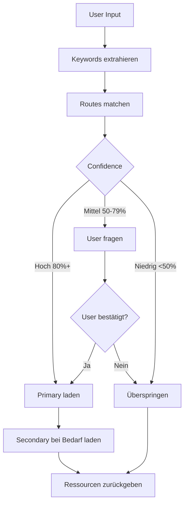

# Context Router

Der Context Router ist Evolvings intelligentes Ressourcen-Ladesystem, das User-Intent (via Keywords) zu relevanten Komponenten mapped und context-effiziente KI-Interaktionen ermöglicht.

## Das Problem

Traditioneller Ansatz: Alles beim Session-Start laden

```
Session Start
    ↓
Alle Rules laden (34K Tokens)
Alle Patterns laden (25K Tokens)
Alle Dokumentation laden (15K Tokens)
    ↓
Total: 74K Tokens genutzt
Context: 37% voll bevor User überhaupt spricht
```

## Die Lösung

Context Router: Nur laden was benötigt wird, wann es benötigt wird

```
Session Start
    ↓
Memory Index laden (2K Tokens)
Aktives Projekt laden (3K Tokens)
    ↓
Total: 5K Tokens genutzt
Context: 2,5% voll

User Request: "Debug dieses Problem"
    ↓
Keywords extrahieren: ["debug", "problem"]
Route matchen: "debugging"
    ↓
Summaries laden (900 Tokens)
    ↓
Total: 5,9K Tokens
Context: 3% voll
```

**Ergebnis:** 92% Token-Ersparnis

## Architektur

### Router-Dateistruktur

```json
{
  "version": "2.0",
  "routes": {
    "debugging": {
      "keywords": ["debug", "error", "fix", "bug"],
      "primary": {
        "patterns": ["systematic-debugging"],
        "rules": ["observe-before-editing"],
        "agents": ["debugger"]
      },
      "secondary": {
        "patterns": ["evidence-before-claims"],
        "rules": ["failure-recovery"]
      }
    }
  }
}
```

### Routing-Flow



## Keyword-Extraktion

### Explizite Keywords

Direkte Matches aus User-Input:

```
User: "Ich muss diesen Fehler debuggen"
Keywords: ["debug", "fehler"]
Match: debugging Route → 100% Confidence
```

### Implizite Keywords

Aus Kontext abgeleitet:

```
User: "Der Login funktioniert nicht"
Implizit: ["bug", "fix", "untersuchen"]
Match: debugging Route → 75% Confidence
```

### Taxonomy-Normalisierung

Einheitliches Keyword-Vokabular:

```json
{
  "debug": {
    "synonyms": ["fix", "troubleshoot", "untersuchen"],
    "related": ["error", "bug", "issue"]
  }
}
```

## Confidence Scoring

### Berechnung

```python
base_confidence = 50

for keyword in user_keywords:
    if keyword in route.keywords:
        confidence += 10
    if keyword in route.secondary_keywords:
        confidence += 5

if multiple_routes_match:
    confidence -= 10

final_confidence = min(100, max(0, confidence))
```

### Schwellenwerte

| Confidence | Aktion | Beispiel |
|------------|--------|----------|
| **80-100%** | Auto-load Primary | "debug" → debugging Route |
| **50-79%** | User fragen | "verbessern" → könnte Refactoring ODER Optimierung sein |
| **0-49%** | Route überspringen | "hallo" → keine technische Route |

## Route-Typen

### 1. Pattern Routes

Prompt Patterns laden:

```json
{
  "route": "creative",
  "keywords": ["verbessern", "verfeinern", "optimieren"],
  "primary": {
    "patterns": ["reflection", "iterative-refinement"]
  }
}
```

### 2. Rule Routes

Verhaltens-Rules laden:

```json
{
  "route": "code-modification",
  "keywords": ["edit", "ändern", "modifizieren"],
  "primary": {
    "rules": ["observe-before-editing", "evidence-before-claims"]
  }
}
```

### 3. Agent Routes

Spezialisten auswählen:

```json
{
  "route": "exploration",
  "keywords": ["finden", "suchen", "erkunden"],
  "primary": {
    "agents": ["Explore"]
  }
}
```

### 4. Hybrid Routes

Ressourcen kombinieren:

```json
{
  "route": "debugging",
  "keywords": ["debug", "error"],
  "primary": {
    "patterns": ["systematic-debugging"],
    "rules": ["observe-before-editing"],
    "agents": ["debugger"]
  }
}
```

## Progressive Ladung

### Layer 1: Detection (Immer)

```json
{
  "route": "debugging",
  "confidence": 85,
  "load_type": "summary"
}
```

Kosten: 0 Tokens (im Speicher gecacht)

### Layer 2: Summary (Hohe Confidence)

```json
{
  "pattern": "systematic-debugging",
  "summary": {
    "core_loop": "Reproduzieren → Evidenz → Hypothese → Testen → Fix",
    "when_to_use": "Bug Fixing, unerwartetes Verhalten",
    "key_points": [...]
  }
}
```

Kosten: ~300 Tokens pro Ressource

### Layer 3: Volle Docs (On Demand)

```markdown
# Systematic Debugging

## Core Loop
1. Issue konsistent reproduzieren
2. Evidenz sammeln (Logs, Stack Traces)
3. Hypothese über Root Cause bilden
4. Hypothese testen
5. Fixen wenn bestätigt
6. Fix verifizieren

[... vollständige Dokumentation ...]
```

Kosten: ~3K Tokens pro Ressource

## Multi-Route-Handling

### Route-Intersection

Wenn multiple Routes matchen:

```
User: "Refactore und teste diesen Code"
Keywords: ["refactor", "test"]
    ↓
Gematchte Routes:
  - refactoring (80%)
  - testing (75%)
    ↓
Aktion: Beide Primary-Ressourcen laden
  - refactoring-pattern
  - test-pattern
```

## Fallback-Strategien

### Kein Route Match

```python
if no_routes_matched:
    # Fallback 1: Command-Detection prüfen
    if command_detected:
        load_command()

    # Fallback 2: General-Purpose Agent nutzen
    elif delegation_score >= 3:
        delegate_to_general()

    # Fallback 3: Direkt antworten
    else:
        respond_directly()
```

## Route-Konfiguration

### Neue Route hinzufügen

```json
{
  "routes": {
    "meine-neue-route": {
      "keywords": ["primär", "keywords"],
      "secondary_keywords": ["verwandt", "begriffe"],
      "primary": {
        "patterns": ["pattern-name"],
        "rules": ["rule-name"],
        "agents": ["agent-name"]
      },
      "secondary": {
        "patterns": ["fallback-pattern"]
      },
      "confidence_boost": 10
    }
  }
}
```

## Best Practices

### DO

✅ **Klare, spezifische Keywords nutzen**
```json
{
  "keywords": ["debug", "error", "fix"]
}
```

✅ **Verwandte Ressourcen gruppieren**
```json
{
  "primary": {
    "patterns": ["systematic-debugging"],
    "rules": ["observe-before-editing"]
  }
}
```

### DON'T

❌ **Vage Keywords verwenden**
```json
{
  "keywords": ["ding", "zeug", "work"]
}
```

❌ **Primary-Ressourcen überladen**
```json
{
  "primary": {
    "patterns": ["p1", "p2", "p3", "p4", "p5"]  // Zu viele
  }
}
```

## Nächste Schritte

- [Memory System](memory-system.md) - Persistenter Zustand
- [Knowledge Graph](knowledge-graph.md) - Entity-Beziehungen
- [Agent-Orchestrierung](agent-orchestration.md) - Delegation
- [Patterns nutzen](../guides/using-patterns.md) - Patterns anwenden
