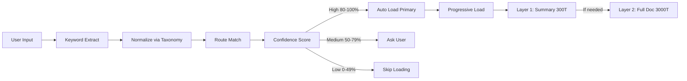

# Context Routing

Context Routing ist das intelligente System, das nur relevante Dokumentation und Patterns basierend auf Task-Keywords ladet, um Kontext-Bloat zu verhindern und gleichzeitig Verfügbarkeit notwendiger Informationen zu sichern.

## Kernkonzept



**Problem**: Laden aller Rules/Patterns verbraucht 25K+ Tokens beim Session-Start.

**Lösung**: Lade nur das Relevante basierend auf Task-Keywords.

## 1. Router-Konfiguration

**Speicherort**: `_graph/cache/context-router.json`

### Schema

```json
{
  "version": "1.2",
  "routes": [
    {
      "id": "debugging",
      "keywords": ["debug", "error", "fix", "bug", "troubleshoot"],
      "aliases": ["issue", "problem", "broken"],
      "primary_items": [
        {
          "type": "rule",
          "path": "knowledge/rules/debugging/observe-before-editing.md",
          "summary": ".claude/summaries/rules/observe-before-editing.json",
          "confidence_boost": 10
        },
        {
          "type": "pattern",
          "path": "knowledge/patterns/systematic-debugging.md",
          "summary": ".claude/summaries/patterns/systematic-debugging.json",
          "confidence_boost": 5
        }
      ],
      "secondary_items": [
        {
          "type": "rule",
          "path": "knowledge/rules/debugging/evidence-before-claims.md",
          "load_if_confidence": 70
        }
      ],
      "anti_keywords": ["create", "new", "generate"],
      "related_routes": ["testing", "failure-recovery"],
      "default_confidence": 60
    }
  ],
  "fallbacks": {
    "no_match": "ask_user",
    "ambiguous": "list_options",
    "max_routes": 3
  }
}
```

### Route-Komponenten

| Komponente | Zweck |
|-----------|-------|
| `keywords` | Positive Signale für diese Route |
| `aliases` | Alternative Begriffe (normalisiert via Taxonomy) |
| `anti_keywords` | Negative Signale (reduziert Confidence) |
| `primary_items` | Immer laden wenn Route passt |
| `secondary_items` | Nur laden wenn Confidence hoch genug |
| `related_routes` | Vorschlagen wenn Primary Route schwach |
| `default_confidence` | Basis-Confidence vor Keyword-Matching |

## 2. Keyword Matching

### Extraction

```
User: "I need to debug this error in the auth service"
     │
     ▼
Extract keywords:
  - "debug" (verb)
  - "error" (noun)
  - "auth" (domain)
  - "service" (component)
```

### Normalisierung

```
Raw keywords: ["debug", "error", "auth", "service"]
     │
     ▼
Taxonomy lookup (_graph/taxonomy.json):
  "debug" → "debugging"
  "error" → "debugging"
  "auth" → "authentication"
  "service" → "architecture"
     │
     ▼
Normalized: ["debugging", "authentication", "architecture"]
```

### Matching-Algorithmus

```typescript
function calculateConfidence(route, userKeywords) {
  let confidence = route.default_confidence;

  // Positive matches
  for (const keyword of userKeywords) {
    if (route.keywords.includes(keyword)) {
      confidence += 10;
    }
    if (route.aliases.includes(keyword)) {
      confidence += 5;
    }
  }

  // Negative matches
  for (const antiKeyword of route.anti_keywords) {
    if (userKeywords.includes(antiKeyword)) {
      confidence -= 15;
    }
  }

  // Boost from primary items
  route.primary_items.forEach(item => {
    if (item.confidence_boost) {
      confidence += item.confidence_boost;
    }
  });

  return Math.min(100, Math.max(0, confidence));
}
```

### Beispiel-Scoring

```
Route: "debugging"
Default confidence: 60

User keywords: ["debug", "error", "fix"]

Matches:
  "debug" in keywords → +10
  "error" in keywords → +10
  "fix" in keywords → +10

Final: 60 + 30 = 90 (High confidence)
```

## 3. Confidence Levels

| Level | Range | Aktion | User Experience |
|-------|-------|--------|-----------------|
| **High** | 80-100% | Auto-load primary items | Silent, seamless |
| **Medium** | 50-79% | User um Bestätigung fragen | "Should I load debugging rules?" |
| **Low** | 0-49% | Skip loading | Normal response, no overhead |

### High Confidence (80-100%)

```
User: "Debug this authentication error"
     │
     ▼
Route: "debugging" (confidence: 92)
     │
     ▼
AUTO LOAD:
  - observe-before-editing.md (summary)
  - systematic-debugging.md (summary)
  - evidence-before-claims.md (if confidence > 70)
     │
     ▼
User sees: No interruption, rules active
```

### Medium Confidence (50-79%)

```
User: "Something is wrong with login"
     │
     ▼
Route: "debugging" (confidence: 65)
     │
     ▼
ASK USER:
  "This looks like a debugging task. Should I load
   debugging rules and patterns?"
     │
     ▼
User: "yes" → Load | "no" → Skip
```

### Low Confidence (<50%)

```
User: "Create a new component"
     │
     ▼
Route: "debugging" (confidence: 20)
     │
     ▼
SKIP: No debugging context needed
```

## 4. Progressive Loading

Drei-Schicht-Ansatz um Token-Nutzung zu minimieren.

### Layer 1: JSON Summary (~300 Tokens)

**Immer geladen** wenn Route passt.

**Speicherort**: `.claude/summaries/{type}/{name}.json`

```json
{
  "id": "rule-observe-before-editing",
  "type": "rule",
  "title": "Observe Before Editing",
  "summary": "Always diagnose before making changes",
  "key_points": [
    "Read diagnostics first",
    "Identify root cause",
    "Verify after edit"
  ],
  "when_to_use": "Before any file edit",
  "when_not": "Trivial changes (typos)",
  "related": ["evidence-before-claims", "failure-recovery"],
  "token_estimate": 280
}
```

**Internalisierung**: Claude liest und versteht die Regel ohne vollständiges Markdown.

### Layer 2: Full Markdown (~3000 Tokens)

**Bei Bedarf geladen** wenn:
- User um "more details" bittet
- Edge Case erkannt
- Implementierungs-Details benötigt
- Summary unzureichend

**Speicherort**: Original `.md` Datei

### Layer 3: Related Context

**Bei Bedarf geladen** via `related` Feld:
- User trifft Edge Case erwähnt in Related Rules
- Task-Komplexität erhöht sich
- Multi-Step-Problem braucht mehrere Patterns

### Loading Decision Tree

```
Route matched (confidence >= 80)
         │
         ▼
┌─────────────────────────────────┐
│ LOAD Layer 1: Summaries         │
│ (~300 tokens per item)          │
└──────────────┬──────────────────┘
               │
         Sufficient?
         /           \
       YES           NO
        │             │
        ▼             ▼
    Continue      User asks
    with task     for details
                      │
                      ▼
              ┌─────────────────────┐
              │ LOAD Layer 2: Full  │
              │ (~3000 tokens/item) │
              └──────────┬──────────┘
                         │
                   Still need more?
                         │
                         ▼
              ┌─────────────────────┐
              │ LOAD Layer 3: Related│
              │ (recursive)         │
              └─────────────────────┘
```

## 5. Multi-Route Handling

### Exact Match (Single Route)

```
User: "Debug the login error"

Routes matched:
  - debugging (95)

Action: Load debugging route
```

### Fuzzy Match (Multiple Routes)

```
User: "I need to improve this code and fix bugs"

Routes matched:
  - debugging (78)
  - refactoring (72)
  - code-quality (65)

Action: Ask user which focus
  "This could be debugging OR refactoring.
   Which should I prioritize?"
```

### Fallback

```
User: "What should I do next?"

Routes matched:
  - (none above 50)

Action: Check fallback config
  → fallbacks.no_match = "ask_user"
  → "I'm not sure what you need. Could you clarify?"
```

## 6. Context Budget Awareness

Router respektiert Kontext-Limits.

### Budget Berechnung

```typescript
const CONTEXT_LIMIT = 200000; // Opus 4.5 tokens
const CURRENT_USAGE = getCurrentUsage();
const AVAILABLE = CONTEXT_LIMIT - CURRENT_USAGE;

if (AVAILABLE < 10000) {
  // Critical: Skip all loading
  return "skip";
} else if (AVAILABLE < 30000) {
  // Tight: Summary only, no full docs
  return "summary_only";
} else {
  // Normal: Progressive loading
  return "progressive";
}
```

### Budget-Aware Loading

| Context Nutzung | Verhalten |
|-----------------|-----------|
| < 70% | Normal: Summary + Full on demand |
| 70-90% | Summary only, no Full docs |
| > 90% | No loading, suggest /clear |

## 7. Integration Points

### Mit Memory System

```
Session Start → Bootup Ritual
     │
     ▼
Load Domain Memory (5K tokens)
     │
     ▼
User request → Context Router
     │
     ▼
Load relevant rules/patterns (3K tokens)
     │
     ▼
Total: ~8K instead of ~30K
```

### Mit Knowledge Graph

```
Router nutzt Graph für Discovery:
  1. User keywords → Normalized
  2. Graph nodes filtered by keywords
  3. Edges followed for related items
  4. Router decides what to load
```

### Mit Metacognitive Orchestrator

```
User request
     │
     ▼
Orchestrator extracts keywords
     │
     ▼
Context Router finds matches
     │
     ▼
Orchestrator loads summaries
     │
     ▼
Pattern activated if high confidence
```

## 8. Route-Beispiele

### Debugging Route

```json
{
  "id": "debugging",
  "keywords": ["debug", "error", "fix", "bug"],
  "primary_items": [
    "observe-before-editing",
    "evidence-before-claims",
    "systematic-debugging"
  ],
  "related_routes": ["testing", "failure-recovery"]
}
```

**Triggers**: "debug", "error", "fix the bug", "troubleshoot"

### Delegation Route

```json
{
  "id": "delegation",
  "keywords": ["delegate", "agent", "task", "sub-agent"],
  "primary_items": [
    "delegation",
    "smart-model-delegation",
    "trait-system"
  ],
  "related_routes": ["orchestration", "task-management"]
}
```

**Triggers**: "delegate this", "use agent", "spawn sub-agent"

### Creative Route

```json
{
  "id": "creative",
  "keywords": ["improve", "refine", "better", "optimize"],
  "primary_items": [
    "reflection-pattern",
    "iterative-refinement"
  ],
  "anti_keywords": ["debug", "fix", "error"],
  "related_routes": ["code-quality"]
}
```

**Triggers**: "improve this", "make it better", "refine the approach"

**Anti-triggers**: "fix error" (debugging, not creative)

## 9. Router-Wartung

### Neue Route hinzufügen

1. **Define keywords**: Was sagt User um diese Route zu triggern?
2. **Set primary items**: Was MUSS laden?
3. **Set secondary items**: Was ist optional?
4. **Define anti-keywords**: Was deutet auf NICHT diese Route?
5. **Link related routes**: Was ist ähnlich?
6. **Test confidence scoring**: Triggert es richtig?

### Routes validieren

```bash
# Test route matching
python scripts/test-router.py --input "debug authentication error"

# Expected output:
# Route: debugging (confidence: 92)
# Primary items: 3
# Secondary items: 1
# Token estimate: ~900
```

### Nutzung monitoring

Track welche Routes am meisten genutzt werden:

```json
{
  "route_usage": {
    "debugging": {"count": 47, "avg_confidence": 85},
    "delegation": {"count": 32, "avg_confidence": 78},
    "creative": {"count": 15, "avg_confidence": 72}
  }
}
```

## 10. Performance-Impact

### Vor Context Router

```
Session start: Load all rules/patterns
Token usage: ~30K tokens
Time: ~2-3 seconds
Relevance: 20-30% actually needed
```

### Nach Context Router

```
Session start: Load only Domain Memory
Token usage: ~5K tokens
Time: ~0.5 seconds

On demand (per task):
Token usage: ~3K tokens (progressive)
Relevance: 90%+ actually needed

Total savings: ~22K tokens per session
```

## Best Practices

### DO

- Nutze normalisierte Keywords via Taxonomy
- Setze Confidence Thresholds konservativ
- Gebe klare Anti-Keywords an
- Linke Related Routes für Fallback
- Monitore Route-Nutzung und justiere nach
- Nutze Progressive Loading (summary → full)

### DON'T

- Match zu breit (niedrige Präzision)
- Setze Confidence zu niedrig (false positives)
- Lade Full Docs sofort
- Ignoriere Context Budget
- Erstelle überlappende Routes ohne Unterscheidung
- Vergesse zu updaten wenn Patterns/Rules hinzufügst

## Related

- [Memory System](./memory-system.md) - Domain Memory Integration
- [Knowledge Graph](./knowledge-graph.md) - Graph-basierte Discovery
- [Agent Orchestration](./agent-orchestration.md) - Pattern Activation
- Metakognitive Orchestrator-Muster - Implementierungsdetails in interner Projektdokumentation
