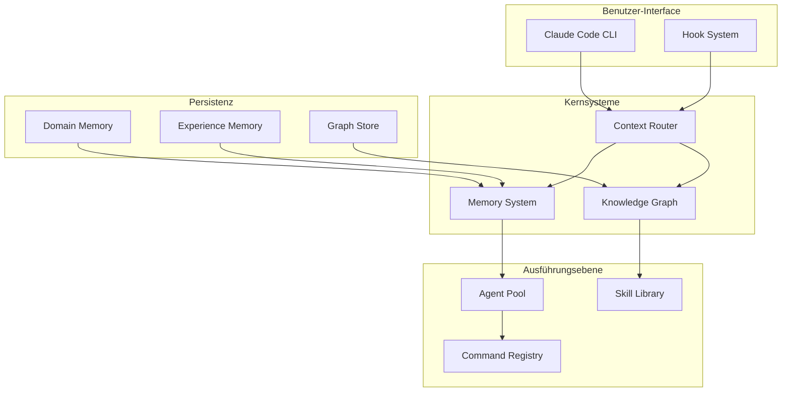
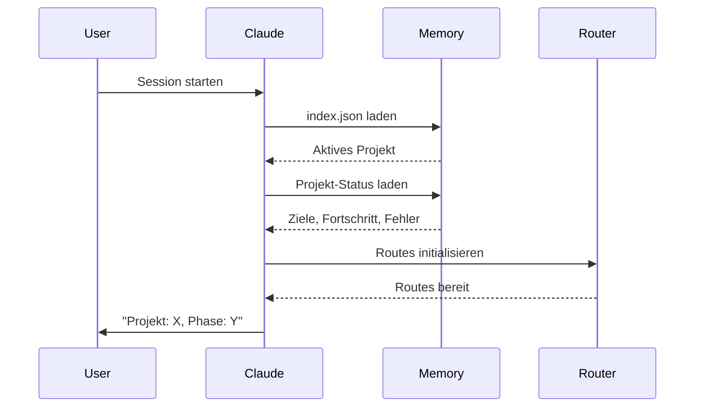
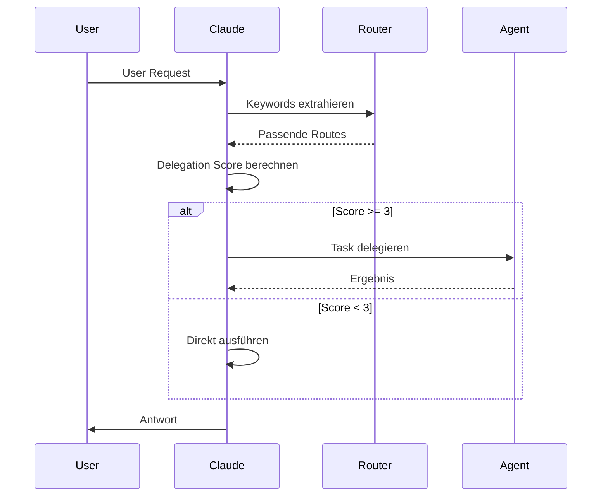

# Architektur

Das Verständnis der Evolving Architektur hilft dir, das volle Potenzial zu nutzen und das System effektiv zu erweitern.

## System-Überblick



## Kernkomponenten

### Memory System

Das Memory System bietet persistenten Zustand über Sessions:

| Komponente | Scope | Zweck |
|------------|-------|-------|
| **Domain Memory** | Projekt | Aktiver Zustand, Fortschritt, Fehler |
| **Experience Memory** | Global | Erlernte Lösungen mit Verfall |
| **Workflow State** | Session | Aktives Workflow-Tracking |

[Mehr zum Memory System →](memory-system.md)

### Knowledge Graph

Ein Netzwerk vernetzter Entitäten:

- **360+ Nodes** - Komponenten, Konzepte, Ressourcen
- **616+ Edges** - Beziehungen zwischen Nodes
- **Taxonomy** - Einheitliches Keyword-Vokabular

[Mehr zum Knowledge Graph →](knowledge-graph.md)

### Context Router

Mappt Keywords auf relevante Ressourcen:

```json
{
  "route": "debugging",
  "keywords": ["debug", "error", "fix", "bug"],
  "primary": ["systematic-debugging", "observe-before-editing"],
  "secondary": ["failure-recovery", "evidence-before-claims"]
}
```

[Mehr zum Context Routing →](context-routing.md)

### Agent Orchestration

Koordinierte Multi-Agent Ausführung:

1. **Task-Analyse** - Delegation Score bestimmen
2. **Agent-Auswahl** - Task mit Spezialist matchen
3. **Ausführung** - Mit passendem Model ausführen
4. **Verifikation** - Ergebnisse validieren

[Mehr zur Agent Orchestration →](agent-orchestration.md)

## Datenfluss

### Session-Start



### Request-Verarbeitung



## Dateistruktur

```
evolving/
├── .claude/
│   ├── agents/         # 68 Agent-Definitionen
│   ├── commands/       # 80 Command-Definitionen
│   ├── skills/         # 13 Skill-Definitionen
│   ├── rules/          # Core Rules (auto-loaded)
│   ├── hooks/          # 22 Hook-Scripts
│   ├── blueprints/     # 10 Blueprints
│   ├── templates/      # 9 Templates
│   └── scenarios/      # 8 Scenarios
├── _memory/
│   ├── index.json      # Aktiver Context
│   ├── projects/       # Projektspezifischer Memory
│   ├── experiences/    # Erlernte Lösungen
│   └── workflows/      # Aktive Workflows
├── _graph/
│   ├── knowledge-nodes.json
│   ├── edges.json
│   ├── taxonomy.json
│   └── cache/
│       └── context-router.json
├── knowledge/
│   ├── patterns/       # 59 Patterns
│   ├── learnings/      # 54 Learnings
│   ├── rules/          # Erweiterte Rules
│   └── graphics/       # Grafik-Tools
└── docs/               # Diese Dokumentation
```

## Erweiterungspunkte

### Komponenten hinzufügen

1. **Agents** - Zu `.claude/agents/` hinzufügen
2. **Commands** - Zu `.claude/commands/` hinzufügen
3. **Patterns** - Zu `knowledge/patterns/` hinzufügen
4. **Rules** - Zu `knowledge/rules/staging/` hinzufügen

### Integrations-Matrix

Beim Hinzufügen von Komponenten aktualisieren:

| Datei | Zweck |
|-------|-------|
| `_stats.json` | Komponenten-Counts |
| `context-router.json` | Keyword-Routing |
| `knowledge-nodes.json` | Graph Node |
| `edges.json` | Beziehungen |
| `SYSTEM-MAP.md` | Dokumentation |

## Design-Prinzipien

1. **Context-Effizienz** - Nur laden was nötig ist
2. **Graceful Failure** - Fehlende Daten handhaben
3. **Selbstdokumentierend** - Komponenten beschreiben sich selbst
4. **Komponierbar** - Fähigkeiten mischen
5. **Beobachtbar** - Verfolgen was passiert

## Weiterführend

- [Memory System](memory-system.md) - Deep Dive in Persistenz
- [Knowledge Graph](knowledge-graph.md) - Entity-Beziehungen
- [Context Routing](context-routing.md) - Keyword Mapping
- [Agent Orchestration](agent-orchestration.md) - Multi-Agent Koordination
