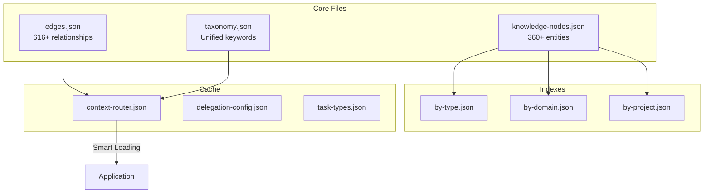

# Knowledge Graph

Der Knowledge Graph ist ein einheitliches Entity-Relationship-System, das alle Komponenten, Patterns und Knowledge Artifacts im Evolving System verbindet.

## Graph-Struktur



## 1. Nodes (Entities)

**Speicherort**: `_graph/knowledge-nodes.json`

Jede Komponente, jedes Pattern und Knowledge Artifact ist ein Node.

### Node Schema

```json
{
  "id": "pattern-reflection",
  "type": "pattern",
  "label": "Reflection Pattern",
  "description": "Self-critique and iterative refinement",
  "keywords": ["reflection", "critique", "iterative", "improvement"],
  "attributes": {
    "category": "reasoning",
    "complexity": 6,
    "use_cases": ["creative", "refinement", "quality"],
    "mutex_group": "A_iteration"
  },
  "metadata": {
    "created": "2026-01-05",
    "last_updated": "2026-01-08",
    "usage_count": 15,
    "success_rate": 0.87
  }
}
```

### Node-Typen (14 Kategorien)

| Typ | Anzahl | Beispiele |
|-----|--------|----------|
| `command` | 63 | /commit, /debug, /explore |
| `agent` | 65 | Explore, debugger, code-reviewer |
| `skill` | 6 | pdf, commit, review-pr |
| `pattern` | 12 | reflection, react, tree-of-thoughts |
| `rule` | 44 | delegation, failure-recovery |
| `template` | 18 | agent-template, command-template |
| `blueprint` | 9 | memory-system, graph-system |
| `hook` | 12 | delegation-enforcer, auto-cross-reference |
| `learning` | 23 | auto-learning, staged-rules |
| `tool` | 8 | Task, Explore, Read, Write |
| `workflow` | 7 | plan-execution, interview-plan |
| `config` | 15 | context-router, delegation-config |
| `memory` | 5 | domain-memory, experience-memory |
| `documentation` | 73 | guides, references, indexes |

### Node-Attribute

Unterschiedliche Node-Typen haben spezialisierte Attribute:

**Pattern Nodes**:
```json
{
  "attributes": {
    "category": "reasoning|multi-agent|decision",
    "complexity": 1-10,
    "mutex_group": "A_iteration|B_multi_agent|C_decision",
    "compatible_with": ["other-pattern-ids"],
    "when_to_use": "Task description",
    "when_not": "Anti-pattern description"
  }
}
```

**Command Nodes**:
```json
{
  "attributes": {
    "category": "workflow|debug|memory|creation",
    "aliases": ["/alias1", "/alias2"],
    "requires_context": ["file", "project"],
    "detection_patterns": ["keyword1", "keyword2"]
  }
}
```

**Agent Nodes**:
```json
{
  "attributes": {
    "plugin": "feature-dev|pr-review-toolkit|builtin",
    "model_preference": "haiku|sonnet|opus",
    "traits": ["engineer", "precise", "iterative"],
    "specialization": "code-review|architecture|exploration"
  }
}
```

## 2. Edges (Relationships)

**Speicherort**: `_graph/edges.json`

Beziehungen zwischen Nodes definieren, wie Komponenten interagieren.

### Edge Schema

```json
{
  "id": "edge-001",
  "source": "pattern-reflection",
  "target": "rule-metacognitive-orchestrator",
  "type": "activates",
  "weight": 0.9,
  "metadata": {
    "confidence": "high",
    "bidirectional": false,
    "context": "Pattern detection triggers orchestrator"
  }
}
```

### Edge-Typen

| Typ | Richtung | Bedeutung |
|-----|----------|-----------|
| `uses` | A → B | A hängt von B ab |
| `related_to` | A ↔ B | Konzeptionell ähnlich |
| `activates` | A → B | A triggert B |
| `requires` | A → B | A braucht B zum Funktionieren |
| `extends` | A → B | A baut auf B auf |
| `implements` | A → B | A realisiert B |
| `documents` | A → B | A beschreibt B |
| `references` | A → B | A erwähnt B |
| `conflicts_with` | A ⊗ B | A und B schließen sich gegenseitig aus |
| `part_of` | A ⊂ B | A ist Komponente von B |

### Beziehungs-Pattern

**Pattern → Rule**:
```json
{
  "source": "pattern-react",
  "target": "rule-metacognitive-orchestrator",
  "type": "activates",
  "weight": 0.85
}
```

**Command → Agent**:
```json
{
  "source": "command-debug",
  "target": "agent-debugger",
  "type": "uses",
  "weight": 1.0
}
```

**Rule → Template**:
```json
{
  "source": "rule-delegation",
  "target": "template-delegation-prompt",
  "type": "references",
  "weight": 0.7
}
```

**Pattern → Pattern (Mutex)**:
```json
{
  "source": "pattern-reflection",
  "target": "pattern-react",
  "type": "conflicts_with",
  "weight": 1.0,
  "metadata": {
    "reason": "Both in mutex_group A_iteration"
  }
}
```

## 3. Taxonomy (Unified Keywords)

**Speicherort**: `_graph/taxonomy.json`

Standardisiertes Keyword-System für konsistentes Routing.

### Schema

```json
{
  "version": "1.0",
  "categories": {
    "workflow": {
      "keywords": ["workflow", "process", "pipeline", "automation"],
      "aliases": ["flow", "procedure"],
      "related_types": ["command", "pattern", "rule"]
    },
    "debugging": {
      "keywords": ["debug", "error", "fix", "troubleshoot"],
      "aliases": ["bug", "issue", "problem"],
      "related_types": ["command", "agent", "pattern"]
    },
    "memory": {
      "keywords": ["memory", "context", "state", "persistence"],
      "aliases": ["recall", "storage", "cache"],
      "related_types": ["rule", "config", "memory"]
    }
  },
  "mappings": {
    "debug": "debugging",
    "bug": "debugging",
    "fix": "debugging",
    "flow": "workflow"
  }
}
```

### Keyword-Normalisierung

```
User Input: "I need to fix this bug"
     │
     ▼
Extract: ["fix", "bug"]
     │
     ▼
Normalize via taxonomy:
  "fix" → "debugging"
  "bug" → "debugging"
     │
     ▼
Unified: ["debugging"]
     │
     ▼
Route to: debug commands, debugger agent, debugging patterns
```

## 4. Indexes

Optimierte Lookups für häufige Zugriffsmuster.

### by-type.json

Gruppiert Nodes nach Typ für schnelles Filtern:

```json
{
  "command": ["command-commit", "command-debug", "..."],
  "agent": ["agent-explore", "agent-debugger", "..."],
  "pattern": ["pattern-reflection", "pattern-react", "..."],
  "rule": ["rule-delegation", "rule-failure-recovery", "..."]
}
```

**Use Case**: "Zeige mir alle verfügbaren Commands"

### by-domain.json

Gruppiert Nodes nach Domain/Tag:

```json
{
  "debugging": [
    "command-debug",
    "agent-debugger",
    "pattern-systematic-debugging",
    "rule-observe-before-editing"
  ],
  "delegation": [
    "rule-delegation",
    "agent-explore",
    "config-delegation-config",
    "template-delegation-prompt"
  ]
}
```

**Use Case**: "Lade den ganzen Debug-Kontext"

### by-project.json

Gruppiert Nodes nach Projekt-Zugehörigkeit:

```json
{
  "evolving-system": [
    "all core nodes",
    "system-specific patterns",
    "custom rules"
  ],
  "auswanderungs-ki-v2": [
    "project-specific commands",
    "domain patterns"
  ]
}
```

**Use Case**: "Welche Tools sind für dieses Projekt verfügbar?"

## 5. Graph-Operationen

### Node Discovery

Finde Nodes nach Kriterien:

```typescript
// By type
nodes.filter(n => n.type === "pattern")

// By keyword
nodes.filter(n => n.keywords.includes("debug"))

// By attribute
nodes.filter(n => n.attributes?.complexity > 7)
```

### Relationship Traversal

Folge Edges von einem Node:

```typescript
// Direct dependencies
edges.filter(e => e.source === "pattern-reflection" && e.type === "uses")

// Related nodes (bidirectional)
edges.filter(e =>
  (e.source === nodeId || e.target === nodeId) &&
  e.type === "related_to"
)

// Conflicts (mutex)
edges.filter(e =>
  e.source === nodeId &&
  e.type === "conflicts_with"
)
```

### Path Finding

Finde Verbindung zwischen zwei Nodes:

```
pattern-reflection
     │ activates
     ▼
rule-metacognitive-orchestrator
     │ uses
     ▼
config-context-router
     │ references
     ▼
template-pattern-summary
```

## 6. Graph-Integration

### Mit Memory System

Graph bietet Struktur, Memory bietet State:

```
User: "How do I delegate tasks?"
     │
     ▼
Graph: Find nodes with keywords ["delegation", "task"]
  → rule-delegation
  → config-delegation-config
  → template-delegation-prompt
     │
     ▼
Memory: Load recent delegation experiences
  → experience-delegation-success-20260108
  → failure-delegation-too-complex-20260107
     │
     ▼
Merged Context: Rules + Recent learnings
```

### Mit Context Router

Router nutzt Graph für intelligentes Laden:

```json
{
  "route": "debugging",
  "keywords": ["debug", "error", "fix"],
  "primary_nodes": [
    "command-debug",
    "agent-debugger",
    "pattern-systematic-debugging"
  ],
  "secondary_nodes": [
    "rule-observe-before-editing",
    "rule-evidence-before-claims"
  ],
  "confidence_threshold": 70
}
```

### Mit Agent Orchestration

Graph definiert Agent-Fähigkeiten und Beziehungen:

```
Task: "Review this code for type safety"
     │
     ▼
Graph lookup by keywords: ["review", "type", "safety"]
     │
     ▼
Nodes found:
  - agent-type-design-analyzer (type="agent", specialization="type-review")
  - pattern-code-review (type="pattern")
  - rule-post-todo-review (type="rule")
     │
     ▼
Orchestrator: Use agent-type-design-analyzer with pattern-code-review
```

## 7. Graph-Wartung

### Auto-Update Triggers

| Event | Aktion |
|-------|--------|
| New command created | Add node, update indexes |
| Agent registered | Add node, create edges zu related patterns |
| Pattern documented | Add node, link zu implementing rules |
| Rule created | Add node, link zu activating patterns |
| Relationship discovered | Add edge |

### Konsistenz-Checks

Automatisiert via `scripts/graph-validator.py`:

```bash
# Check for orphan nodes (no edges)
python scripts/graph-validator.py --check orphans

# Validate edge references
python scripts/graph-validator.py --check edges

# Detect circular dependencies
python scripts/graph-validator.py --check cycles

# Verify index completeness
python scripts/graph-validator.py --check indexes
```

### Manuelle Updates

Wann manuell aktualisieren:

1. **Node-Attribute ändern**: Update attributes section
2. **Neue Beziehung entdeckt**: Add edge
3. **Keyword-Verfeinerung**: Update taxonomy
4. **Index veraltet**: Regenerieren via Script

## 8. Query Patterns

### Häufige Queries

**Finde alle Commands in einer Kategorie**:
```javascript
nodes
  .filter(n => n.type === "command" && n.attributes.category === "debugging")
  .map(n => n.label)
```

**Finde verwandte Patterns für einen Task**:
```javascript
const taskKeywords = ["review", "code", "quality"];
nodes
  .filter(n =>
    n.type === "pattern" &&
    n.keywords.some(k => taskKeywords.includes(k))
  )
```

**Finde Agents die einen Task handhaben können**:
```javascript
const requiredTraits = ["engineer", "precise"];
nodes
  .filter(n =>
    n.type === "agent" &&
    requiredTraits.every(t => n.attributes.traits?.includes(t))
  )
```

**Finde Mutex Patterns**:
```javascript
edges
  .filter(e => e.type === "conflicts_with" && e.source === "pattern-reflection")
  .map(e => e.target)
```

## 9. Graph-Statistiken

Aktuelle Statistiken (Stand 2026-01-08):

| Metrik | Anzahl |
|--------|--------|
| Total nodes | 360+ |
| Total edges | 616+ |
| Node types | 14 |
| Edge types | 10 |
| Avg edges per node | 1.7 |
| Max edges (hub) | 23 (rule-delegation) |
| Orphan nodes | 0 |
| Circular deps | 0 |

### Hub Nodes (Most Connected)

| Node | Typ | Edge Count | Rolle |
|------|-----|-----------|-------|
| rule-delegation | rule | 23 | Orchestration hub |
| config-context-router | config | 19 | Routing hub |
| pattern-reflection | pattern | 15 | Reasoning hub |
| agent-explore | agent | 14 | Discovery hub |
| template-agent-template | template | 12 | Creation hub |

## Best Practices

### DO

- Nutze Indexes für Bulk-Lookups (by-type, by-domain)
- Folge Edges um verwandte Contexts zu entdecken
- Normalisiere Keywords via Taxonomy
- Behalte bidirektionale Edges für related_to
- Update Graph wenn Komponenten hinzufügst/entfernst

### DON'T

- Query nodes.json direkt ohne Indexes
- Erstelle Edges ohne weight/metadata
- Nutze nicht-Standard Keywords (nutze Taxonomy)
- Lasse Orphan Nodes zurück (alle Nodes brauchen >= 1 Edge)
- Vergesse Indexes nach Änderungen zu aktualisieren

## Related

- [Memory System](./memory-system.md) - Zustandsverwaltung
- [Context Routing](./context-routing.md) - Intelligentes Laden via Graph
- [Agent Orchestration](./agent-orchestration.md) - Agent-Discovery via Graph
- Komponenten-Inventar - Siehe interne Projektdokumentation
