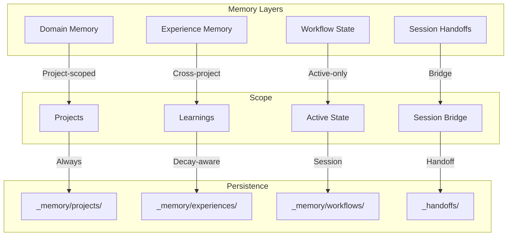

# Memory System

Das Memory System bietet persistente, strukturierte Zustandsverwaltung über Sessions hinweg, was dem System ermöglicht zu lernen, sich anzupassen und Kontext über die Zeit zu bewahren.

## Memory-Typen



## 1. Domain Memory

**Speicherort**: `_memory/projects/{project-name}.json`

Projektspezifischer State, der über Sessions persistent bleibt.

### Schema

```json
{
  "id": "evolving-system",
  "name": "Evolving System",
  "description": "Self-improving Claude Code configuration",
  "goals": ["Maintain system health", "Enable AI-first development"],
  "state": {
    "current_phase": "Intelligence System v3.3.0",
    "blockers": [],
    "active_workflows": []
  },
  "features": [
    {
      "name": "Domain Memory",
      "status": "passing",
      "last_tested": "2026-01-08"
    }
  ],
  "progress": [
    {
      "date": "2026-01-08",
      "action": "Implemented hydrate pattern",
      "result": "Single-call context loading",
      "next": "Test multi-project memory"
    }
  ],
  "failures": [
    {
      "date": "2026-01-07",
      "what": "Memory not loaded at session start",
      "why": "Missing bootup rule enforcement",
      "learned": "Make bootup CRITICAL priority"
    }
  ]
}
```

### Schlüsselkonzepte

| Feld | Zweck | Aktualisierungshäufigkeit |
|------|-------|---------------------------|
| `goals` | Hochrangige Ziele | Selten (Projektumfang-Änderung) |
| `state.current_phase` | Aktive Arbeitsphase | Pro Phase-Übergang |
| `features` | Feature-Status-Tracking | Pro Feature-Fertigstellung/Test |
| `progress` | Atomare Progress-Einträge | Pro bedeutende Aktion |
| `failures` | Bekannte Probleme & Learnings | Pro Fehler-Auftreten |

### Hydrate Pattern

Single-Call Loading aller Memory-Typen beim Session-Start:

```
Session Start
     │
     ▼
┌─────────────────────────────────┐
│ HYDRATE (Parallel Read)         │
│                                 │
│ 1. index.json → active project  │
│ 2. projects/{active}.json       │
│ 3. experiences/ (decay-filtered)│
│ 4. workflows/active.json        │
└──────────────┬──────────────────┘
               │
               ▼
         Merged Context
```

## 2. Experience Memory

**Speicherort**: `_memory/experiences/{type}-{slug}-{date}.json`

Projektübergreifendes Lernen mit Decay-bewusstsein.

### Schema

```json
{
  "id": "solution-supabase-rls-20260108",
  "type": "solution",
  "title": "Supabase RLS Policy Debugging",
  "summary": "Use auth.uid() not user_id for RLS policies",
  "tags": ["supabase", "auth", "rls", "debugging"],
  "projects": ["auswanderungs-ki-v2"],
  "created": "2026-01-08T14:30:00Z",
  "metadata": {
    "base_relevance": 80,
    "decay_rate": 0.95,
    "trust_level": "high",
    "valid_until": null,
    "spaced_rep": {
      "interval_days": 7,
      "next_review": "2026-01-15T00:00:00Z",
      "review_count": 0
    }
  },
  "content": {
    "problem": "RLS policies failing silently",
    "solution": "Use auth.uid() instead of user_id column",
    "why": "user_id is NULL during policy evaluation",
    "when_to_use": "Any Supabase RLS policy"
  }
}
```

### Experience-Typen

| Typ | Zweck | Decay Rate | Trust Level |
|-----|-------|------------|-------------|
| `solution` | Problem-Lösungs-Paare | 0.95 | high |
| `pattern` | Wiederverwendbare Ansätze | 0.98 | medium |
| `decision` | Architektur-Entscheidungen | 0.99 | high |
| `failure` | Bekannte Fallstricke | 0.90 | high |
| `optimization` | Performance-Verbesserungen | 0.92 | medium |

### Decay-System

Relevanz sinkt über Zeit basierend auf Decay Rate:

```
effective_relevance = base_relevance * (decay_rate ^ days_since_created) * trust_multiplier

WHERE trust_multiplier:
  - high: 1.0
  - medium: 0.8
  - low: 0.6
```

**Loading Filter**:
- Nur Experiences mit `effective_relevance > 30` laden
- `valid_until` respektieren (zeitliche Gültigkeit)
- Projekt-Match ODER hohe Relevanz (>70)

### Spaced Repetition

Experiences verwenden Spaced Repetition zur Verstärkung:

```json
{
  "spaced_rep": {
    "interval_days": 7,
    "next_review": "2026-01-15T00:00:00Z",
    "review_count": 2,
    "last_reviewed": "2026-01-08T10:00:00Z"
  }
}
```

**Interval Skalierung**:
- `confirm`: interval × 2.5 (gut erinnert)
- `practice`: interval × 2.0 (brauchte Übung)
- `skip`: interval × 0.8 (vergessen)

## 3. Workflow State

**Speicherort**: `_memory/workflows/active.json`

Aktiver Workflow-State (z.B. Plan execution, Interview).

### Schema

```json
{
  "workflow": "plan-execution",
  "plan_path": "knowledge/plans/v3-3-0-plan.md",
  "current_phase": 2,
  "current_task": "2.3",
  "checklist": {
    "1.1": "completed",
    "1.2": "completed",
    "2.1": "completed",
    "2.2": "completed",
    "2.3": "in_progress"
  },
  "delegation_log": [
    {
      "task": "1.1",
      "agent": "Explore",
      "model": "haiku",
      "result": "success"
    }
  ],
  "started": "2026-01-08T09:00:00Z",
  "last_updated": "2026-01-08T14:30:00Z"
}
```

**Lebenszyklus**:
1. Erstellt beim Workflow-Start (z.B. Plan execution)
2. Aktualisiert nach jeder Task-Fertigstellung
3. Gelöscht nach Workflow-Abschluss
4. Zu Experience Memory archiviert falls nötig

## 4. Session Handoffs

**Speicherort**: `_handoffs/YYYY-MM-DD-{description}.md`

Brücke zwischen Sessions mit strukturiertem Kontext-Transfer.

### Template

```markdown
# Handoff: {Description}

**Date**: YYYY-MM-DD HH:MM
**Project**: {project-name}
**Status**: {complete|partial|blocked}

---

## What Was Done

- Task 1: Description
- Task 2: Description

## Current State

- Feature X: passing
- Feature Y: in_progress

## Next Steps

1. High-priority task
2. Medium-priority task

## Known Issues

- Issue 1: Description + workaround
- Issue 2: Description

## Context for Next Session

Important decisions, caveats, or context needed.

---

## Files Changed

- `path/to/file1.ts` - what changed
- `path/to/file2.py` - what changed

## Commits

```bash
abc123f feat: Add feature X
def456g fix: Resolve issue Y
```
```

### Handoff-Typen

| Status | Bedeutung | Nächste Session |
|--------|-----------|-----------------|
| `complete` | Ganze geplante Arbeit erledigt | Neu anfangen oder überprüfen |
| `partial` | Einige Arbeiten erledigt, mehr benötigt | Aus "Next Steps" fortsetzen |
| `blocked` | Kann nicht weitermachen | Blocker zuerst lösen |

## Memory Bootup Ritual

**Priorität**: CRITICAL beim Session-Start

```
1. READ _memory/index.json
   → Extract: active_project, active_workflow

2. READ _memory/projects/{active}.json
   → Extract: goals, state, progress, failures

3. READ _memory/experiences/ (decay-filtered)
   → Load: relevant solutions, patterns, decisions

4. READ _graph/cache/context-router.json
   → Extract: routes for active domain

5. ANNOUNCE
   "Project: {name} | Phase: {phase}
    Last: {progress}
    Issues: {failures count}
    Experiences: {experiences count}
    Next: {next}"
```

### Continue Trigger

Wenn User "continue" nach `/clear` sagt:

```
1. LOAD latest handoff (ls -t _handoffs/*.md | head -1)
2. EXTRACT open tasks
3. LOAD plan if referenced
4. START immediately (no questions)
5. CREATE TodoWrite for open tasks
```

### Resume Trigger

Wenn User "resume {name}" sagt:

```
1. LOAD _memory/sessions/index.json
2. FIND session with name = "{name}"
3. LOAD handoff_file + project
4. RESTORE context
5. START immediately
```

## Memory Update Triggers

| Event | Aktion |
|-------|--------|
| Task completed | Progress entry |
| Feature finished | Feature status → passing |
| Error occurred | Failure entry |
| Phase changed | state.current_phase |
| Session end | Progress + next step |
| Learning extracted | Experience creation |

## Integration

### Mit Knowledge Graph

Memory und Graph arbeiten zusammen:

```
Memory provides:
- Project state
- Recent learnings
- Known failures

Graph provides:
- Entity relationships
- Pattern connections
- Tool/command discovery
```

### Mit Context Router

Context Router verwendet Memory für intelligentes Laden:

```
1. User input → Keywords
2. Router matches → Routes
3. Memory + Graph → Relevant context
4. Progressive load → Summaries first
```

## Best Practices

### DO

- Update progress nach JEDER signifikanten Aktion
- Log failures sofort mit Root Cause
- Nutze Hydrate pattern für Session-Start Loading
- Erstelle Handoffs für komplexe/unterbrochene Arbeit
- Wende Decay Filter an beim Laden von Experiences

### DON'T

- Lade alle Experiences (verwende effective_relevance filter)
- Überspringe Memory Bootup beim Session-Start
- Update Memory nur beim Session-Ende
- Speichere Session-lokale States in Domain Memory
- Erstelle Experiences für triviale Learnings

## Related

- [Knowledge Graph](./knowledge-graph.md) - Entity-basierter Kontext
- [Context Routing](./context-routing.md) - Intelligentes Laden
- [Agent Orchestration](./agent-orchestration.md) - Task-Koordination
- Domain-Memory-Bootup-Regeln - Implementierungsdetails in interner Projektdokumentation
