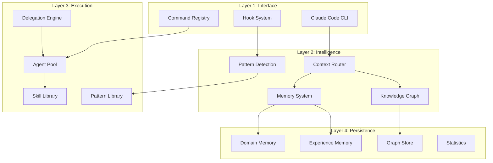
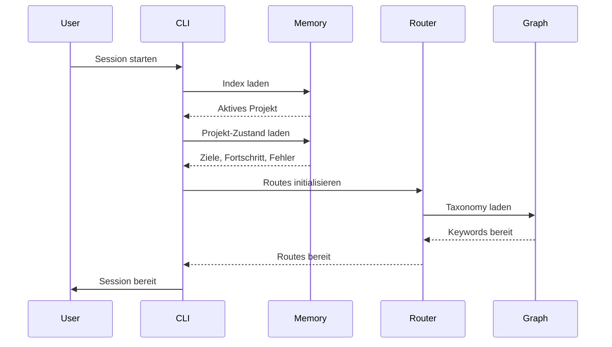
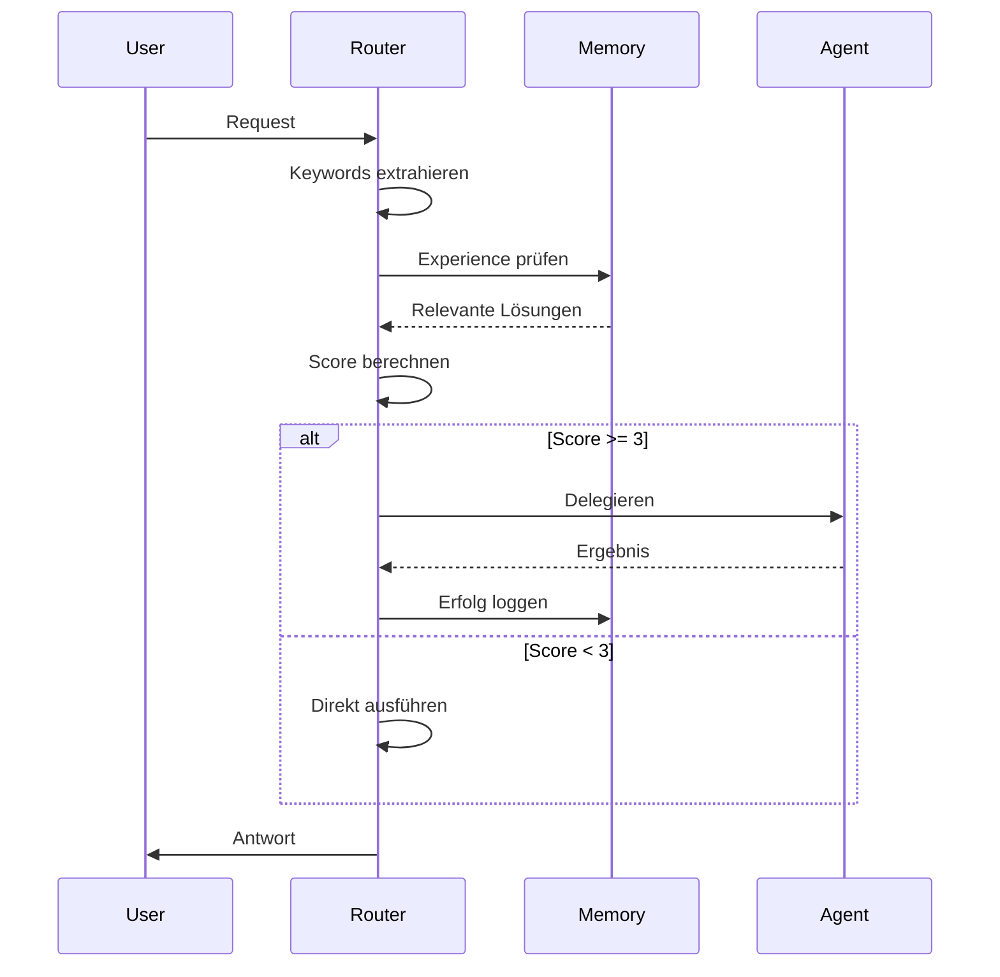

# Architektur-Übersicht

Das Evolving System basiert auf einer geschichteten Architektur, die Concerns trennt und gleichzeitig Flexibilität und Erweiterbarkeit beibehält.

## Architektur-Schichten



## Kern-Systeme

### 1. Memory System

Persistenter Zustand über Sessions hinweg:

- **Domain Memory** - Projektziele, Fortschritt, Fehler
- **Experience Memory** - Gelernte Lösungen mit Verfall
- **Workflow State** - Aktives Task-Tracking

[Deep Dive: Memory System →](memory-system.md)

### 2. Knowledge Graph

Netzwerk verbundener Entities:

- **360+ Nodes** - Komponenten und Konzepte
- **616+ Edges** - Beziehungen und Dependencies
- **Taxonomy** - Einheitliches Keyword-Vokabular

[Deep Dive: Knowledge Graph →](knowledge-graph.md)

### 3. Context Router

Intelligentes Ressourcen-Laden:

- **Keyword-Extraktion** - User-Intent verstehen
- **Route Matching** - Relevante Ressourcen finden
- **Confidence Scoring** - Entscheiden was geladen wird

[Deep Dive: Context Routing →](context-routing.md)

### 4. Agent-Orchestrierung

Multi-Agent-Koordination:

- **Task-Analyse** - Delegation Score berechnen
- **Agent-Auswahl** - Task zu Spezialist matchen
- **Parallele Ausführung** - Unabhängige Tasks zusammen laufen
- **Ergebnis-Synthese** - Agent-Outputs kombinieren

[Deep Dive: Agent-Orchestrierung →](agent-orchestration.md)

## Datenfluss-Patterns

### Session-Initialisierung



### Request-Verarbeitung



## Komponenten-Integration

### Dateisystem-Layout

```
evolving/
├── .claude/              # Konfigurations-Layer
│   ├── agents/          # Agent-Definitionen
│   ├── commands/        # Command-Definitionen
│   ├── skills/          # Wiederverwendbare Skills
│   ├── rules/           # Verhaltens-Rules
│   ├── hooks/           # Event-Handler
│   └── templates/       # Komponenten-Templates
│
├── _memory/             # Persistence-Layer
│   ├── index.json      # Einstiegspunkt
│   ├── projects/       # Domain Memory
│   ├── experiences/    # Solution Memory
│   └── analytics/      # Usage-Tracking
│
├── _graph/              # Knowledge-Layer
│   ├── knowledge-nodes.json
│   ├── edges.json
│   ├── taxonomy.json
│   └── cache/
│       └── context-router.json
│
└── knowledge/           # Ressourcen-Layer
    ├── patterns/       # Prompt Patterns
    ├── learnings/      # Extrahierte Lektionen
    ├── rules/          # Erweiterte Rules
    └── graphics/       # Visualisierungs-Tools
```

### Integrations-Matrix

Beim Hinzufügen von Komponenten diese Dateien updaten:

| Komponente | Stats | Router | Nodes | Edges | SYSTEM-MAP |
|-----------|:-----:|:------:|:-----:|:-----:|:----------:|
| Agent | ✅ | ✅ | ✅ | ✅ | ✅ |
| Command | ✅ | ✅ | ✅ | ✅ | ✅ |
| Skill | ✅ | ✅ | ✅ | ✅ | ✅ |
| Pattern | ✅ | ✅ | ✅ | ✅ | - |
| Rule | ✅ | ✅ | ✅ | - | ✅ |
| Hook | ✅ | - | - | - | ✅ |

## Design-Prinzipien

### 1. Progressive Disclosure

Ressourcen in Schichten laden:

```
Base (5K Tokens)
  ↓ Keyword Match
Summary (300 Tokens)
  ↓ Details benötigt
Full (3K Tokens)
```

**Ergebnis:** 90% Token-Ersparnis

### 2. Graceful Failures

Fehlende Daten behandeln:

```python
try:
    load_resource()
except NotFound:
    use_default()
    continue
```

### 3. Self-Documenting

Komponenten beschreiben sich selbst:

```yaml
---
name: agent-name
description: Was es macht
capabilities: [liste]
---
```

### 4. Komponierbar

Mischen und Kombinieren:

```
Agent + Skill + Pattern = Capability
Command + Hook = Automation
Memory + Graph = Intelligence
```

## Extension Points

### Agents hinzufügen

1. `.claude/agents/{name}.md` erstellen
2. In `_stats.json` registrieren
3. Route in `context-router.json` hinzufügen
4. Graph Node erstellen
5. `SYSTEM-MAP.md` updaten

[Guide: Agents erstellen →](../guides/creating-agents.md)

### Commands hinzufügen

1. `.claude/commands/{name}.md` erstellen
2. Zu Detection Index hinzufügen
3. Im Graph registrieren
4. Dokumentation updaten

[Guide: Commands schreiben →](../guides/writing-commands.md)

## Performance-Charakteristiken

### Memory-Operationen

| Operation | Zeit | Impact |
|-----------|------|--------|
| Session Bootup | ~200ms | Index + Projekt laden |
| Context Routing | ~50ms | Keyword Match |
| Agent-Delegation | ~1-5s | Model-abhängig |
| Graph-Query | ~10ms | In-Memory Lookup |

### Token-Ökonomie

| Szenario | Ohne System | Mit System | Ersparnis |
|----------|-------------|-----------|-----------|
| Session Start | 34K Tokens | 5K Tokens | 85% |
| Simple Task | 10K Tokens | 2K Tokens | 80% |
| Komplexe Task | 50K Tokens | 15K Tokens | 70% |

## Sicherheits-Überlegungen

### Sandbox-Execution

Alle Code-Ausführung in kontrollierten Umgebungen:

```python
# Agents können NICHT zugreifen auf:
- System-Dateien außerhalb Workspace
- Netzwerk ohne Permission
- Credentials oder Secrets
```

### Memory-Isolation

Projekte sind memory-isoliert:

```json
{
  "projekt-a": {
    "goals": ["A-spezifisch"]
  },
  "projekt-b": {
    "goals": ["B-spezifisch"]
  }
}
```

## Monitoring und Debugging

### System-Health

System-Status prüfen:

```bash
/health-dashboard
```

Zeigt:
- Memory-Nutzung
- Aktive Agents
- Hook-Status
- Graph-Integrität

## Nächste Schritte

- [Memory System](memory-system.md) - Persistence-Details
- [Knowledge Graph](knowledge-graph.md) - Entity-Netzwerk
- [Context Routing](context-routing.md) - Ressourcen-Ladung
- [Agent-Orchestrierung](agent-orchestration.md) - Multi-Agent-Koordination
