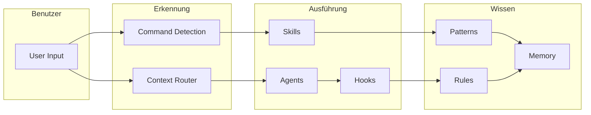

# Komponenten

Das Evolving System besteht aus **331+ Komponenten**, organisiert in verschiedene Typen, die jeweils einen spezifischen Zweck im AI-First Development Workflow erfüllen.

## Komponenten-Typen

<div class="component-grid" markdown>

<div class="component-card" markdown>
### [Agents](agents/index.md)
**68 Komponenten**

Autonome KI-Einheiten für spezifische Aufgaben. Von Code Review bis Security Audits.
</div>

<div class="component-card" markdown>
### [Commands](commands/index.md)
**80 Komponenten**

Benutzeraufrufbare Aktionen via `/name` Syntax. Schneller Zugriff auf häufige Workflows.
</div>

<div class="component-card" markdown>
### [Skills](skills/index.md)
**13 Komponenten**

Spezialisierte Fähigkeiten auf Abruf. Tiefe Expertise in spezifischen Bereichen.
</div>

<div class="component-card" markdown>
### [Rules](rules/index.md)
**53 Komponenten**

Verhaltensrichtlinien und Einschränkungen. Definieren wie das System sich verhalten soll.
</div>

<div class="component-card" markdown>
### [Hooks](hooks/index.md)
**22 Komponenten**

Event-getriggerte Callbacks. Automatisiere Reaktionen auf bestimmte Aktionen.
</div>

<div class="component-card" markdown>
### [Patterns](patterns/index.md)
**59 Komponenten**

Wiederverwendbare Lösungsvorlagen. Bewährte Ansätze für häufige Probleme.
</div>

<div class="component-card" markdown>
### [Blueprints](blueprints/index.md)
**10 Komponenten**

Komplexe Strukturvorlagen. Erstelle ganze Systeme aus Templates.
</div>

<div class="component-card" markdown>
### [Templates](templates/index.md)
**9 Komponenten**

Inhalts-Generierungsstrukturen. Konsistente Formatierung für verschiedene Ausgaben.
</div>

</div>

## Statistiken

| Metrik | Wert |
|--------|------|
| **Gesamt Komponenten** | 331+ |
| **Knowledge Graph Nodes** | 360 |
| **Graph Edges** | 616 |
| **Context Routes** | 47 |

## Wie Komponenten zusammenarbeiten



## Komponenten finden

### Nach Typ
Nutze die Navigation um Komponenten nach Typ zu durchsuchen.

### Nach Tag
Komponenten sind mit Kategorien getaggt wie:
- `orchestration` - Agent Koordination
- `memory` - Zustandspersistenz
- `automation` - Getriggerte Verhaltensweisen
- `security` - Auditing und Validierung
- `graphics` - Visuelle Inhaltserstellung

### Per Suche
Nutze die Suchleiste (oben rechts) um Komponenten nach Name oder Keyword zu finden.

### Via API
Greife programmatisch auf Komponenten-Metadaten zu:

```bash
# Alle Komponenten
curl https://evolving.readthedocs.io/api/components.json

# Spezifischer Typ
curl https://evolving.readthedocs.io/api/agents.json
```

## Komponenten-Lebenszyklus

1. **Discovery** - Gefunden via Context Router oder Suche
2. **Loading** - Metadaten und Inhalt in Context geladen
3. **Execution** - Komponente führt ihre Funktion aus
4. **Tracking** - Ergebnisse in Domain Memory geloggt

## Komponenten erstellen

Siehe unsere Anleitungen zum Erstellen neuer Komponenten:

- [Agents erstellen](../guides/creating-agents.md)
- [Commands schreiben](../guides/writing-commands.md)
- [System erweitern](../guides/extending-system.md)
