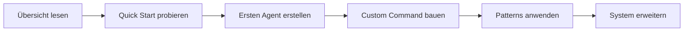

# Kernkonzepte

Das Verständnis dieser Kernkonzepte hilft dir, die volle Leistungsfähigkeit des Evolving Systems zu nutzen.

## Fundament

Das Evolving System basiert auf drei Säulen:

### Speichergesteuerte KI

Anders als traditionelle Chatbots, die zwischen Sessions alles vergessen, behält Evolving einen persistenten Zustand:

- **Domain Memory** - Projektziele, Fortschritt und Fehler
- **Experience Memory** - Lösungen die funktioniert haben, mit Zeitverfall
- **Session Context** - Aktiver Workflow und aktuelle Aufgaben

[Mehr über Memory-Systeme →](../architecture/memory-system.md)

### Kontextbewusstes Routing

Lade nur was du brauchst, wann du es brauchst:

- **Keyword-Erkennung** - Intent aus natürlicher Sprache extrahieren
- **Confidence Scoring** - Entscheiden was geladen wird (hoch/mittel/niedrig)
- **Progressive Disclosure** - Mit Zusammenfassungen beginnen, Details bei Bedarf laden

[Mehr über Context Routing →](../architecture/context-routing.md)

### Agent-Orchestrierung

Koordiniere spezialisierte KI-Arbeiter für komplexe Aufgaben:

- **Delegation** - Aufgaben an den richtigen Spezialisten routen
- **Parallele Ausführung** - Unabhängige Aufgaben gleichzeitig ausführen
- **Review-Pipelines** - Automatische Qualitätsprüfungen

[Mehr über Agent-Orchestrierung →](../architecture/agent-orchestration.md)

## Schlüsselkonzepte

### Domain Memory

Das persistente Gehirn deines Projekts:

```json
{
  "project": "meine-app",
  "current_phase": "Implementation",
  "goals": ["Feature A", "Feature B"],
  "progress": [
    {
      "date": "2025-01-15",
      "action": "Auth-Service implementiert",
      "result": "passing",
      "next": "Tests hinzufügen"
    }
  ]
}
```

[Deep Dive in Domain Memory →](domain-memory.md)

### Prompt Patterns

Wiederverwendbare Ansätze für häufige Szenarien:

- **Reflection** - Iterative Selbstkritik
- **React** - Reason + Act Zyklen
- **Tree of Thoughts** - Entscheidungszweige erkunden
- **Blackboard** - Multi-Agent Kollaboration

[Mehr über Prompt Patterns →](prompt-patterns.md)

### Knowledge Graph

Ein Netzwerk aus 360+ verbundenen Entities:

```
Command ──nutzt──> Agent ──implementiert──> Pattern
   │                 │                        │
   └─triggert─> Hook └──────hängt ab──> Rule
```

[Knowledge Graph erkunden →](../architecture/knowledge-graph.md)

### Context Router

Mapped deine Intention zu relevanten Ressourcen:

```
User: "Ich muss das debuggen"
  ↓ Keywords extrahieren: ["debug", "error"]
  ↓ Routes finden: debugging
  ↓ Laden: systematic-debugging, observe-before-editing
  ↓ Agent: debugger (sonnet)
```

[Mehr über Context Routing →](../architecture/context-routing.md)

## Design-Prinzipien

### 1. Context-Effizienz

Nur das Nötige laden:

- **Session Start**: ~5K Tokens (Memory + Index)
- **On Demand**: Patterns/Rules bei Keyword-Match laden
- **Progressiv**: Erst Zusammenfassungen, dann volle Docs bei Bedarf

### 2. Proaktive Intelligenz

Das System antizipiert Bedürfnisse:

- **Auto-Delegation** - Score ≥ 3 = automatisch delegieren
- **Hook System** - Auf Events reagieren (Write, Commit, Session-End)
- **Pattern-Erkennung** - Workflow-Trigger erkennen

### 3. Selbstverbesserung

Lernen aus Interaktionen:

- **Correction Tracking** - User-Korrekturen werden zu Rules
- **Experience Memory** - Lösungen mit Confidence-Verfall
- **Auto-Learning** - Lektionen aus Fehlern extrahieren

### 4. Komponierbarkeit

Komponenten mischen und kombinieren:

- **Agents** können **Skills** nutzen
- **Commands** rufen **Agents** auf
- **Patterns** kombinieren **Rules**
- **Hooks** triggern **Workflows**

## Einstiegspfad



1. **Verstehen** - [System-Übersicht](overview.md)
2. **Üben** - [Quick Start Guide](../getting-started/quick-start.md)
3. **Erstellen** - [Agents erstellen](../guides/creating-agents.md)
4. **Automatisieren** - [Commands schreiben](../guides/writing-commands.md)
5. **Skalieren** - [System erweitern](../guides/extending-system.md)

## Quick Reference

### Memory-Pfade

```
_memory/
├── index.json              # Aktiver Kontext
├── projects/
│   └── {projekt}.json     # Domain Memory
└── experiences/           # Lösungen mit Verfall
```

### Graph-Dateien

```
_graph/
├── knowledge-nodes.json   # 360+ Entities
├── edges.json            # 616+ Beziehungen
├── taxonomy.json         # Einheitliche Keywords
└── cache/
    └── context-router.json
```

### Komponenten-Verzeichnisse

```
.claude/
├── agents/       # 68 autonome Worker
├── commands/     # 80 User-Aktionen
├── skills/       # 13 wiederverwendbare Fähigkeiten
├── rules/        # Core-Verhalten
└── hooks/        # 22 Event-Handler
```

## Nächste Schritte

- [System-Übersicht](overview.md) - Architektur verstehen
- [Domain Memory](domain-memory.md) - Deep Dive in Memory
- [Prompt Patterns](prompt-patterns.md) - Patterns meistern
- [Quick Start](../getting-started/quick-start.md) - Hands-on
