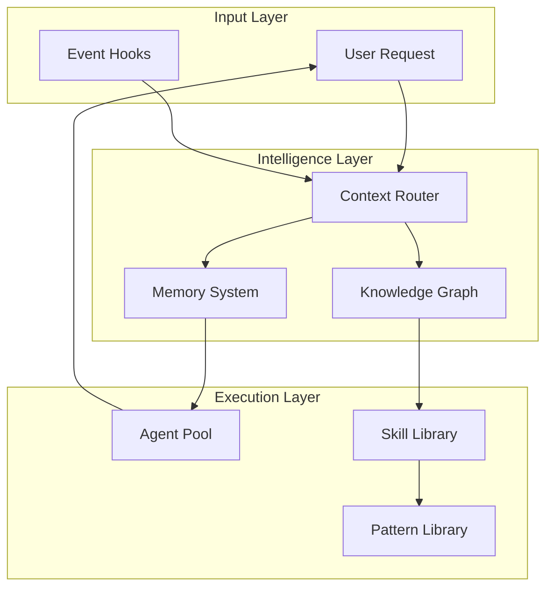
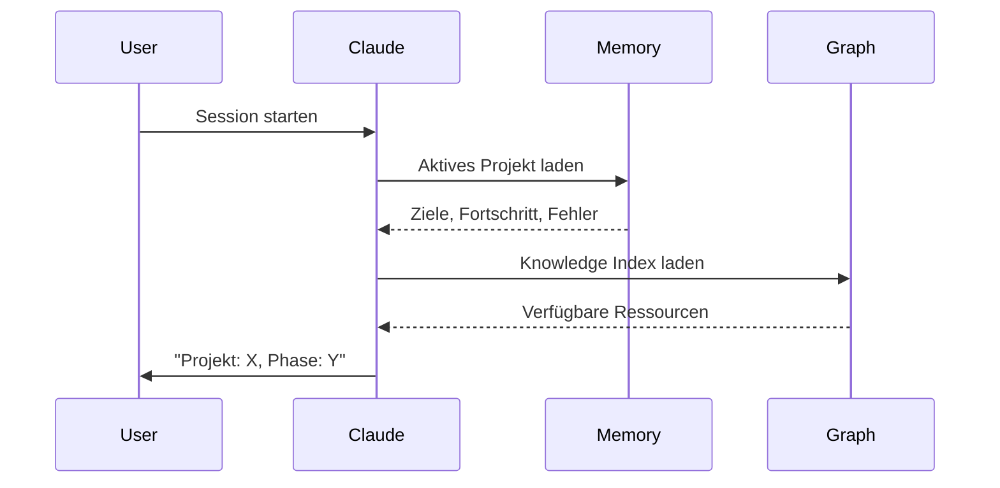

# System-Übersicht

Evolving ist ein hochentwickeltes KI-Assistenten-Framework, das persistenten Zustand beibehält, aus Interaktionen lernt und intelligent Kontext basierend auf User-Intent routet.

## Was macht Evolving anders?

### Traditionelle KI-Assistenten

```
User: "Debug dieses Problem"
AI: [Lädt alles] → Hoher Context, langsam
    [Vergisst nach Session] → Kein Lernen
    [Keine Spezialisierung] → Generische Antworten
```

### Evolving

```
User: "Debug dieses Problem"
AI: [Lädt nur Debugging-Kontext] → Niedriger Context, schnell
    [Erinnert Projekt-Zustand] → Baut auf Historie auf
    [Delegiert an Spezialisten] → Experten-Antwort
```

## Kernarchitektur



## Die drei Säulen

### 1. Memory System

Erhält Kontext über Sessions hinweg:

**Domain Memory** - Projekt-spezifischer Zustand
```json
{
  "project": "meine-app",
  "current_phase": "Implementation",
  "goals": ["Auth", "API"],
  "progress": [
    {"action": "Setup", "result": "done"}
  ],
  "failures": []
}
```

**Experience Memory** - Gelernte Lösungen
```json
{
  "pattern": "RLS Policy Fix",
  "solution": "auth.uid() statt current_user_id() verwenden",
  "confidence": 0.85,
  "decay_factor": 0.95,
  "last_used": "2025-01-15"
}
```

[Mehr über Memory →](../architecture/memory-system.md)

### 2. Context Router

Mapped Keywords zu Ressourcen:

```
Keywords: ["debug", "error"]
    ↓
Route: debugging
    ↓
Laden:
  - Rules: observe-before-editing
  - Patterns: systematic-debugging
  - Agents: debugger
```

**Vorteile:**
- 5K Tokens statt 34K laden
- Nur relevante Ressourcen
- Schnellere Antwortzeiten

[Mehr über Routing →](../architecture/context-routing.md)

### 3. Agent-Orchestrierung

Spezialisten koordinieren:

```
Task: "Auth-Feature implementieren"
    ↓
Delegation Score: 7 (multi-file, komplex)
    ↓
Agents:
  - code-architect (Design)
  - feature-dev (Implementation)
  - code-reviewer (Qualitätsprüfung)
```

[Mehr über Agents →](../architecture/agent-orchestration.md)

## Informationsfluss

### Session-Start



## Komponentenökosystem

### Agents (68)

Autonome Task-Executor:

- **Explore** - Codebase suchen und analysieren
- **Debugger** - Systematisches Debugging
- **Code-Reviewer** - Qualitätsprüfungen
- **Type-Analyzer** - Typsystem-Design

[Guide: Agents erstellen →](../guides/creating-agents.md)

### Commands (80)

User-aufrufbare Aktionen:

- `/health-dashboard` - System-Diagnostik
- `/whats-next` - Handoff generieren
- `/review-plan` - Execution-Plan validieren

[Guide: Commands schreiben →](../guides/writing-commands.md)

### Patterns (59)

Wiederverwendbare Ansätze:

- **Reflection** - Selbstkritik-Schleifen
- **React** - Reason + Act Zyklen
- **Systematic Debugging** - Evidenz-basierte Fixes

[Guide: Patterns nutzen →](../guides/using-patterns.md)

## Schlüsselfeatures

### Progressive Context-Ladung

```
Base Load (5K Tokens)
    ↓
Keyword Match → Summaries laden (300 Tokens je)
    ↓
Komplexer Fall → Volle Docs laden (3K Tokens)
```

**Ergebnis:** 90% Token-Ersparnis

### Auto-Delegation

```
Task-Analyse
    ↓
Score >= 3?
    ↓
JA → Task Tool (Spezialist-Agent)
NEIN → Direkt ausführen
```

**Ergebnis:** Richtige Fähigkeit für den Job

### Selbstlernen

```
User-Korrektur
    ↓
Pattern-Erkennung
    ↓
Rule-Generierung (staged)
    ↓
3+ Erfolge → Production
```

**Ergebnis:** System verbessert sich über Zeit

## Design-Philosophie

### 1. Context ist kostbar

Nur laden was nötig:
- Session Start: minimal (~5K)
- On Demand: gezielt (300-3K)
- Progressiv: Zusammenfassung → vollständig

### 2. Spezialisieren, nicht Generalisieren

Richtiges Werkzeug für den Job:
- Explore: haiku (schnell, günstig)
- Implementation: sonnet (ausgewogen)
- Komplexes Reasoning: opus (tief)

### 3. Aus Erfahrung lernen

Über Zeit verbessern:
- Tracken was funktioniert
- Fehler merken
- Patterns extrahieren
- Rules generieren

### 4. Graceful Failures

Edge Cases behandeln:
- Fehlende Dateien → überspringen, fortfahren
- Ungültige Daten → Defaults verwenden
- Fehlgeschlagene Delegation → direkt ausführen

## Nächste Schritte

- [Kernkonzepte](index.md) - Wesentliche Prinzipien
- [Domain Memory](domain-memory.md) - Deep Dive in Memory
- [Prompt Patterns](prompt-patterns.md) - Patterns meistern
- [Architektur](../architecture/index.md) - Technische Details
