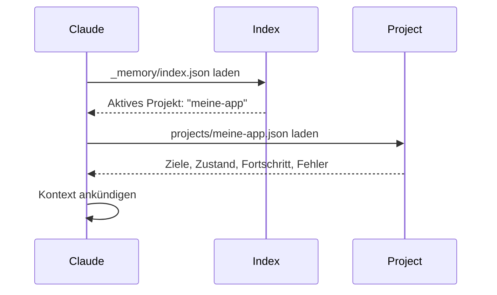
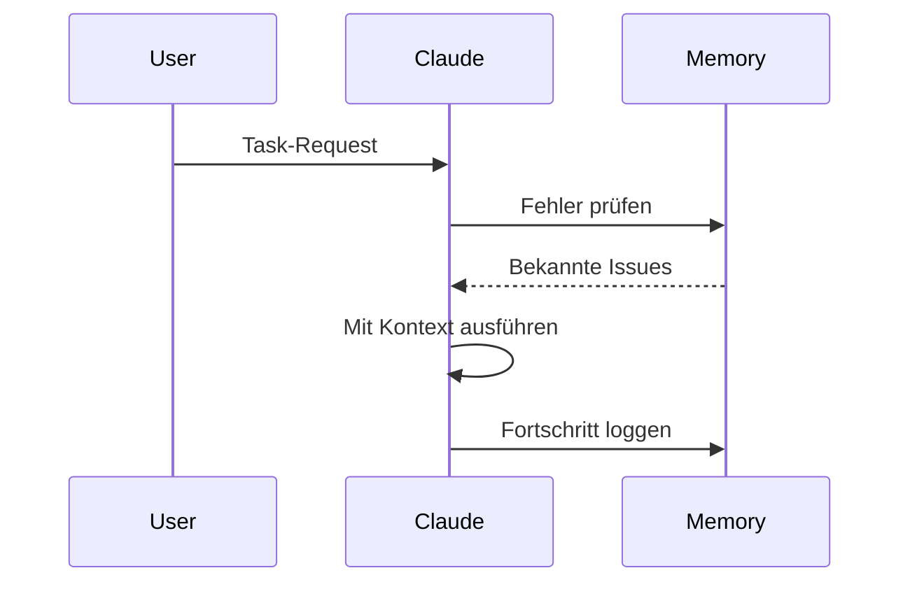
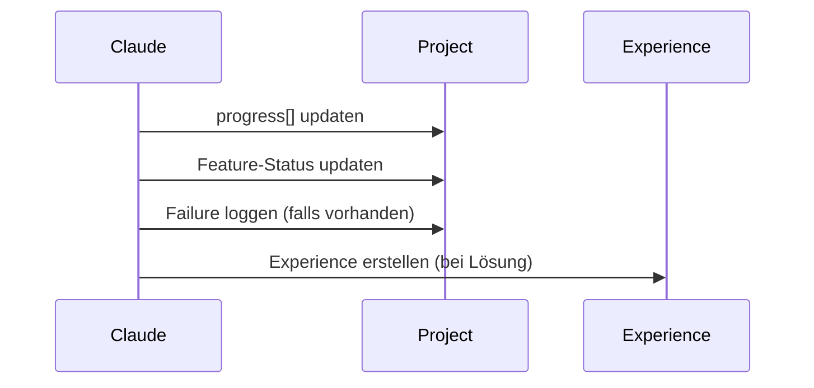

# Domain Memory

Domain Memory ist Evolvings persistentes Projekt-Zustands-System, das Kontext über Sessions hinweg erhält und der KI ermöglicht, sich an Ziele zu erinnern, Fortschritt zu tracken und aus Fehlern zu lernen.

## Was ist Domain Memory?

Traditionelle KI-Assistenten sind zustandslos - sie vergessen alles nach jeder Session. Domain Memory löst dies durch Pflege eines persistenten Records von:

- **Projektzielen** und Features
- **Aktuellem Zustand** und Phase
- **Fortschrittshistorie** mit Timestamps
- **Bekannten Fehlern** und ihren Lösungen

## Memory-Struktur

### Index-Datei

`_memory/index.json` - Der Einstiegspunkt

```json
{
  "active_context": {
    "project": "meine-app",
    "workflow": null,
    "last_updated": "2025-01-15T14:30:00Z"
  },
  "projects": {
    "meine-app": {
      "path": "projects/meine-app.json",
      "last_accessed": "2025-01-15T14:30:00Z"
    }
  }
}
```

### Projekt-Memory

`_memory/projects/meine-app.json` - Projekt-spezifischer Zustand

```json
{
  "metadata": {
    "name": "meine-app",
    "created": "2025-01-01T10:00:00Z",
    "description": "Full-stack App mit Auth und API"
  },
  "goals": [
    {
      "id": "auth",
      "description": "User Authentication System",
      "status": "passing"
    },
    {
      "id": "api",
      "description": "RESTful API Layer",
      "status": "in_progress"
    }
  ],
  "state": {
    "current_phase": "Implementation",
    "blocking_issues": []
  },
  "progress": [
    {
      "date": "2025-01-15",
      "action": "JWT-Authentifizierung implementiert",
      "result": "passing",
      "next": "Refresh-Token-Logik hinzufügen"
    }
  ],
  "failures": [
    {
      "date": "2025-01-14",
      "what": "RLS Policy lehnte gültigen User ab",
      "why": "Falsche Auth-Funktion verwendet",
      "learned": "auth.uid() statt current_user_id() verwenden"
    }
  ]
}
```

## Session-Lebenszyklus

### 1. Bootup (Session-Start)



**Was Claude sagt:**

```
"Projekt: meine-app | Phase: Implementation
 Letzter Stand: JWT-Auth implementiert (passing)
 Nächster Schritt: Refresh-Token-Logik hinzufügen
 Fortfahren?"
```

### 2. Work (Während Session)



**Memory-Checks:**
- Haben wir das schon mal gelöst?
- Gibt es bekannte Fehler zu vermeiden?
- Was ist der aktuelle Zustand?

### 3. Update (Nach Completion)



## Memory-Operationen

### Memory lesen

Claude liest Memory automatisch beim Session-Start:

```python
# Automatisch (Bootup Ritual)
READ _memory/index.json
READ _memory/projects/{active}.json

# Ergebnis: Voller Kontext geladen
```

### Memory schreiben

Nach abgeschlossener Arbeit:

```python
# Progress Entry
project.progress.append({
  "date": "2025-01-16",
  "action": "Was gemacht wurde",
  "result": "Ergebnis",
  "next": "Vorgeschlagener nächster Schritt"
})

# Feature-Status updaten
project.goals[feature_id].status = "passing"

# Failure loggen (falls zutreffend)
project.failures.append({
  "date": "2025-01-16",
  "what": "Was schief ging",
  "why": "Root Cause",
  "learned": "Lektion für nächstes Mal"
})
```

## Integration mit Experience Memory

Domain Memory (Projekt-Zustand) + Experience Memory (gelernte Lösungen) arbeiten zusammen:

### Domain Memory

```json
{
  "failures": [
    {
      "what": "RLS Policy Problem",
      "learned": "auth.uid() verwenden"
    }
  ]
}
```

### Experience Memory

```json
{
  "type": "solution",
  "pattern": "RLS Policy Fix",
  "solution": "auth.uid() statt current_user_id() verwenden",
  "confidence": 0.85,
  "effective_relevance": 75
}
```

**Workflow:**
1. Fehler passiert → In Domain Memory loggen
2. Lösung gefunden → Experience erstellen
3. Ähnliches Issue → Beide Memories abfragen
4. Gelernte Lösung anwenden

[Mehr über Experience Memory →](../architecture/memory-system.md#2-experience-memory)

## Best Practices

### DO

✅ **Nach jeder Session updaten**
```json
{
  "progress": [{
    "date": "2025-01-16",
    "action": "Was du abgeschlossen hast",
    "result": "Ergebnis",
    "next": "Nächster logischer Schritt"
  }]
}
```

✅ **Failures mit Lektionen loggen**
```json
{
  "failures": [{
    "what": "Spezifisches Problem",
    "why": "Root Cause",
    "learned": "Was nächstes Mal zu tun ist"
  }]
}
```

✅ **Feature-Status tracken**
```json
{
  "goals": [{
    "status": "passing"  // Updaten wenn complete
  }]
}
```

### DON'T

❌ **Vage Progress-Einträge**
```json
{
  "action": "Bisschen was gemacht"  // Zu generisch
}
```

❌ **Failure-Logging überspringen**
```json
// User trifft auf Fehler, du fixst ihn, aber loggst nicht
// Nächste Session: Gleicher Fehler nochmal!
```

❌ **Status nicht updaten vergessen**
```json
{
  "status": "in_progress"  // Aber eigentlich done
}
```

## Nächste Schritte

- [Memory System Architektur](../architecture/memory-system.md) - Technische Details
- [Experience Memory](../architecture/memory-system.md#2-experience-memory) - Gelernte Lösungen
- [Quick Start](../getting-started/quick-start.md) - Selbst ausprobieren

## Memory-Operationen (Erweitert)

### Memory abfragen

Memory wird überprüft auf:

**Bekannte Fehler:**
```python
if task_keywords_match(memory.failures):
  warn_user("Wir haben das versucht und es schlug fehl, weil...")
```

**Ähnlicher Fortschritt:**
```python
if similar_action_in_progress:
  suggest_approach("Letztes Mal haben wir X gemacht, was funktioniert hat")
```

**Blockierende Issues:**
```python
if current_state.blocking_issues:
  alert("Bekannte Blocker: {issues}")
```

### Feature-Status

```json
{
  "id": "auth",
  "status": "passing"  // oder "failing" oder "in_progress"
}
```

**Auswirkung:**
- `passing` → Kann darauf bauen
- `in_progress` → Erst abschließen
- `failing` → Erst fixen bevor weitermachen

### Phase-Tracking

```json
{
  "current_phase": "Implementation"
}
```

**Phasen:**
- `Planning` → Design-Entscheidungen
- `Implementation` → Code schreiben
- `Testing` → Funktionalität verifizieren
- `Refinement` → Polieren und optimieren
