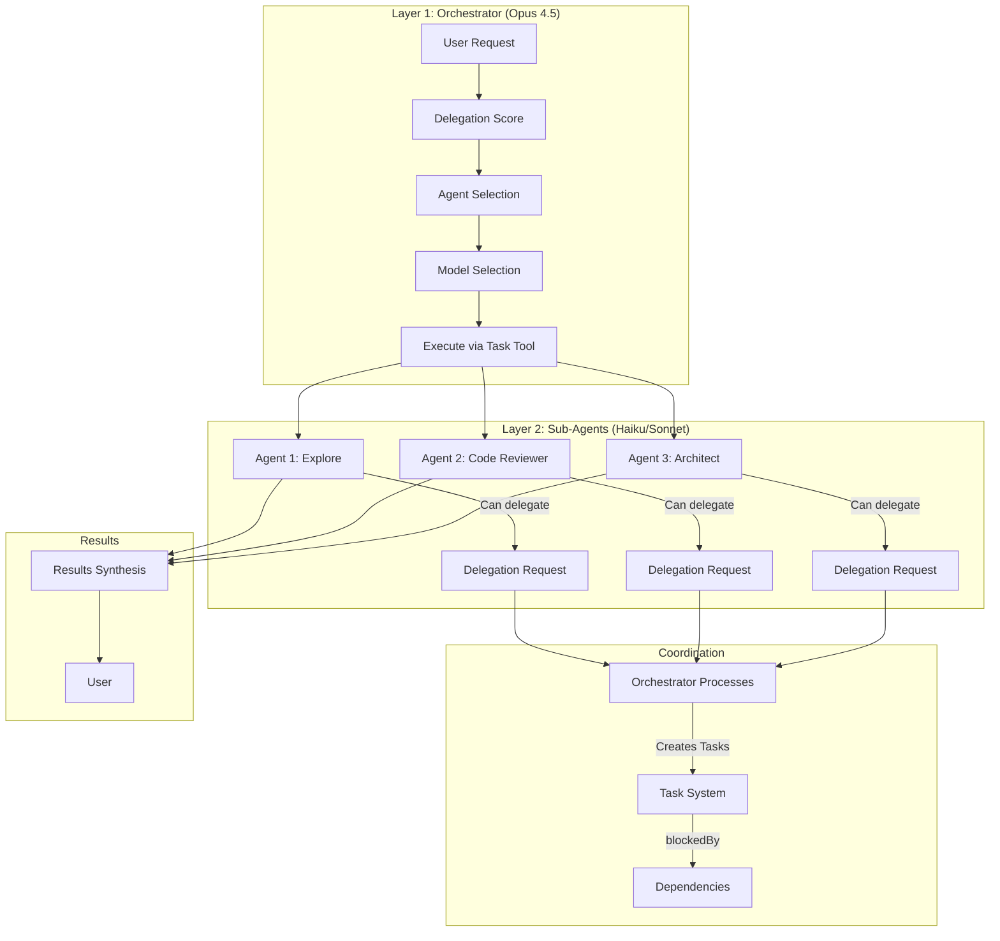

# Agent Orchestration

Agent orchestration is the intelligent delegation and coordination system that spawns specialized sub-agents for complex tasks, manages dependencies, and optimizes model selection.

## Core Concept



**Key Principle**: "Plans coordinate specialists, they don't do specialist work."

## 1. Delegation Scoring

Automatic decision: Should this task be delegated?

### Score Factors

**Positive (+)**:

| Signal | Points | Example |
|--------|--------|---------|
| Scope > 2 files | +2 | "Refactor auth across 3 files" |
| Bulk operation | +2 | "Update all imports" |
| Research/Learn | +2 | "How does X work?" |
| Code review | +2 | "Review this PR" |
| Exploration | +3 | "Find all uses of Y" |
| Independent task | +2 | Task doesn't need main context |

**Negative (-)**:

| Signal | Points | Example |
|--------|--------|---------|
| Critical keywords | -10 | "deploy to production" |
| User wants to see | -5 | "show me", "explain to me" |
| Complexity > 6 | -3 | Too complex for sub-agent |

### Decision Threshold

```
Score >= 3 → DELEGATE (automatic, no asking)
Score < 3  → DO DIRECTLY
```

### Example Scoring

**Example 1: Exploration**
```
User: "Find all hooks in the .claude directory"

Signals:
  - Keywords: "find", "all" → +3 (exploration)
  - Scope: multiple files → +2
  - Independent: yes → +2

Score: 7 → DELEGATE to Explore (haiku)
```

**Example 2: Simple Edit**
```
User: "Fix typo in README"

Signals:
  - Scope: 1 file → 0
  - Trivial: yes → 0

Score: 0 → DO DIRECTLY
```

**Example 3: Critical Operation**
```
User: "Deploy to production"

Signals:
  - Critical keyword: "production" → -10

Score: -10 → DO DIRECTLY (with user confirmation)
```

## 2. Agent Selection

### Built-in Agents (Priority 1)

| Agent | Use Case | Model | Delegation Score |
|-------|----------|-------|------------------|
| **Explore** | Search, find, discover | haiku | Always (exploration keywords) |
| **debugger** | Bug analysis, root cause | sonnet | Always (debug keywords) |
| **Plan** | Multi-step planning | sonnet | Always (/plan command) |

**Trigger**: Explicit keywords or commands.

### Plugin Agents (Priority 2)

**feature-dev** plugin:

| Agent | Specialization | Model | Use Case |
|-------|----------------|-------|----------|
| code-reviewer | General code quality | sonnet | Post-todo review |
| code-architect | Architecture & design | sonnet | Structural review |
| code-explorer | Codebase analysis | haiku | Code understanding |

**pr-review-toolkit** plugin:

| Agent | Specialization | Model | Use Case |
|-------|----------------|-------|----------|
| type-design-analyzer | Type safety | sonnet | New types/interfaces |
| silent-failure-hunter | Error handling | sonnet | Silent bugs |
| pr-test-analyzer | Test coverage | sonnet | Test quality |
| comment-analyzer | Documentation | haiku | Comment accuracy |
| code-simplifier | Complexity reduction | sonnet | Refactoring |

**Trigger**: Post-todo review, plan execution, explicit request.

### Trait-Based (Priority 3)

When no specific agent matches, compose from traits.

**Trait Categories**:

- **Expertise**: engineer, researcher, architect, security, analyst
- **Personality**: precise, direct, cautious, thorough, skeptical
- **Approach**: systematic, iterative, exploratory, adversarial

**Example Composition**:

```
Task: "Fix authentication bug"
→ Traits: engineer + precise + iterative
→ Model: sonnet (complexity 4-6)
→ Agent: general-purpose with trait profile
```

**480 possible combinations** from trait system.

### Selection Algorithm

```typescript
function selectAgent(task, score) {
  // Priority 1: Built-in agents
  if (task.keywords.includes("explore") || task.keywords.includes("find")) {
    return { agent: "Explore", model: "haiku" };
  }
  if (task.keywords.includes("debug") || task.keywords.includes("error")) {
    return { agent: "debugger", model: "sonnet" };
  }
  if (task.keywords.includes("plan")) {
    return { agent: "Plan", model: "sonnet" };
  }

  // Priority 2: Plugin agents
  if (task.type === "code_review") {
    return { agent: "feature-dev:code-reviewer", model: "sonnet" };
  }
  if (task.type === "type_analysis") {
    return { agent: "pr-review-toolkit:type-design-analyzer", model: "sonnet" };
  }

  // Priority 3: Trait-based
  const traits = inferTraits(task);
  return { agent: "general-purpose", traits, model: selectModel(task.complexity) };
}
```

## 3. Model Selection

Smart model routing based on complexity.

### Complexity Scale (1-10)

| Level | Characteristics | Model | Cost |
|-------|----------------|-------|------|
| **1-3** | Simple, single-file, known solution | haiku | $ |
| **4-6** | Moderate, multi-file, some analysis | sonnet | $$ |
| **7+** | Complex, architecture, novel problem | opus/self | $$$ |

### Complexity Factors

```typescript
function calculateComplexity(task) {
  let complexity = 1;

  // Scope
  if (task.files > 5) complexity += 2;
  else if (task.files > 2) complexity += 1;

  // Novelty
  if (task.hasNovelProblem) complexity += 2;
  if (task.requiresArchitectureChange) complexity += 3;

  // Analysis depth
  if (task.requiresDeepAnalysis) complexity += 2;
  if (task.hasUnclearRequirements) complexity += 1;

  // Dependencies
  if (task.crossComponent) complexity += 1;
  if (task.hasExternalDeps) complexity += 1;

  return Math.min(10, complexity);
}
```

### Model Decision Matrix

| Task Type | Typical Complexity | Model |
|-----------|-------------------|-------|
| Codebase search | 2 | haiku |
| Simple bug fix | 3 | haiku |
| Feature implementation | 5 | sonnet |
| Code review | 4 | sonnet |
| Architecture design | 8 | opus/self |
| Complex refactoring | 7 | opus/self |
| System integration | 6 | sonnet |

### Example Decisions

**Search task**:
```
Task: "Find all authentication handlers"
Complexity: 2 (simple search)
Model: haiku
Cost: ~$0.01
```

**Review task**:
```
Task: "Review PR for type safety"
Complexity: 5 (analysis + recommendations)
Model: sonnet
Cost: ~$0.05
```

**Architecture task**:
```
Task: "Design multi-tenant data isolation"
Complexity: 9 (novel + complex)
Model: opus (don't delegate, do self)
Cost: ~$0.50
```

## 4. Task Dependencies

Coordinate parallel and sequential work with `blockedBy`.

### Dependency Patterns

**Sequential**:
```
Task 1: Define schema
Task 2: Implement API (blockedBy: [1])
Task 3: Add tests (blockedBy: [2])
```

**Parallel + Join**:
```
Task 1: Backend API (no deps)
Task 2: Frontend component (no deps)
Task 3: Integration test (blockedBy: [1, 2])
```

**Prerequisite**:
```
Task 1: Setup environment (no deps)
Task 2: Install deps (blockedBy: [1])
Task 3: Configure app (blockedBy: [1])
Task 4: Run tests (blockedBy: [2, 3])
```

### Task Creation with Dependencies

```typescript
// Create tasks
await TaskCreate({
  subject: "Implement API endpoint",
  description: "Build POST /auth/login endpoint",
  activeForm: "Implementing API endpoint"
}); // → Task #1

await TaskCreate({
  subject: "Add integration tests",
  description: "Test login flow end-to-end",
  activeForm: "Adding integration tests"
}); // → Task #2

// Set dependency
await TaskUpdate({
  taskId: "2",
  addBlockedBy: ["1"]
});

// Task #2 will wait until Task #1 is completed
```

### Parallel Execution

When tasks have no dependencies, execute in parallel:

```typescript
// All independent - execute in parallel
const tasks = [
  Task({ agent: "Explore", prompt: "Find auth handlers" }),
  Task({ agent: "Explore", prompt: "Find DB queries" }),
  Task({ agent: "Explore", prompt: "Find API routes" })
];

// All execute simultaneously
const results = await Promise.all(tasks);
```

## 5. Delegation-Request Pattern

Sub-agents (Layer 2) can't spawn more sub-agents. Instead, they return a structured request.

### Pattern Flow

```
Orchestrator (Layer 1)
     │
     │ Delegates Task X
     ▼
Sub-Agent (Layer 2)
     │
     │ Realizes: "This is too complex!"
     │
     ▼
┌─────────────────────────────────┐
│ DELEGATION REQUEST              │
│                                 │
│ {                               │
│   "delegation_request": true,   │
│   "reason": "...",              │
│   "recommended_tasks": [...]    │
│ }                               │
└─────────────────────────────────┘
     │
     │ Returns to orchestrator
     ▼
Orchestrator (Layer 1)
     │
     │ Validates request
     │ Creates Tasks
     │ Executes delegation
     ▼
New Sub-Agents (Layer 2)
```

### Request Format

```json
{
  "delegation_request": true,
  "reason": "Feature requires 3 independent modules",
  "recommended_tasks": [
    {
      "subject": "Implement auth module",
      "model": "sonnet",
      "agent": "general-purpose",
      "traits": ["engineer", "precise"],
      "blockedBy": []
    },
    {
      "subject": "Implement API module",
      "model": "sonnet",
      "agent": "general-purpose",
      "traits": ["engineer", "precise"],
      "blockedBy": []
    },
    {
      "subject": "Integration tests",
      "model": "haiku",
      "agent": "general-purpose",
      "blockedBy": ["Implement auth module", "Implement API module"]
    }
  ]
}
```

### Orchestrator Execution

```typescript
async function handleDelegationRequest(request) {
  // 1. Validate
  if (!request.delegation_request) return;
  if (!request.recommended_tasks?.length) return;

  // 2. Create Tasks
  const taskIds = {};
  for (const task of request.recommended_tasks) {
    const result = await TaskCreate({
      subject: task.subject,
      description: task.description || task.subject,
      activeForm: `Working on ${task.subject}`
    });
    taskIds[task.subject] = result.taskId;
  }

  // 3. Set Dependencies
  for (const task of request.recommended_tasks) {
    if (task.blockedBy?.length) {
      const blockerIds = task.blockedBy.map(name => taskIds[name]);
      await TaskUpdate({
        taskId: taskIds[task.subject],
        addBlockedBy: blockerIds
      });
    }
  }

  // 4. Execute (parallel where possible)
  const results = await executeTasks(taskIds);

  // 5. Synthesize results
  return synthesizeResults(results);
}
```

## 6. Hint-Based Delegation

Plans can specify delegation explicitly via hints.

### Hint Types

| Hint | Meaning | Example |
|------|---------|---------|
| `[EXPLORE]` | Use Explore agent | `Task 1.1: Find all hooks [EXPLORE]` |
| `[DELEGATE]` | Use appropriate agent | `Task 1.2: Implement API [DELEGATE]` |
| `[DELEGATE:agent-name]` | Use specific agent | `Task 1.3: Review code [DELEGATE:code-reviewer]` |
| `[DIRECT]` | Don't delegate | `Task 1.4: Fix typo [DIRECT]` |

### Execution Flow

```
For each task in plan:
     │
     ▼
Extract hint from title
     │
     ├─ [EXPLORE] → Explore agent (haiku)
     ├─ [DELEGATE] → Score-based selection
     ├─ [DELEGATE:X] → Agent X
     └─ [DIRECT] → Execute directly
```

### Example Plan

```markdown
## Phase 1: Analysis

### Task 1.1: Map authentication flow `[EXPLORE]`
Find all auth-related handlers, middleware, and guards.

### Task 1.2: Review type definitions `[DELEGATE:type-design-analyzer]`
Analyze User, Session, and Auth types for safety.

### Task 1.3: Fix typo in login.ts `[DIRECT]`
Change "authenitcation" to "authentication".

## Phase 2: Implementation

### Task 2.1: Implement OAuth flow `[DELEGATE]`
Add Google OAuth2 authentication.

### Task 2.2: Phase review `[DELEGATE:code-reviewer]`
Review all Phase 2 changes.
```

## 7. Swarm Coordination

Coordinate multiple agents working on different aspects.

### Fan-Out Pattern

```
User: "Analyze this codebase for issues"
     │
     ▼
Orchestrator spawns parallel:
  ├─ code-reviewer → General quality
  ├─ type-design-analyzer → Type safety
  ├─ silent-failure-hunter → Error handling
  └─ pr-test-analyzer → Test coverage
     │
     ▼
Results synthesized → Report
```

### Sequential Pattern

```
User: "Implement and test new feature"
     │
     ▼
Task 1: Implement feature
  → Delegates to engineer agent
     │
     ▼
Task 2: Review implementation (blockedBy: [1])
  → Delegates to code-reviewer
     │
     ▼
Task 3: Add tests (blockedBy: [2])
  → Delegates to engineer agent
     │
     ▼
Task 4: Test review (blockedBy: [3])
  → Delegates to pr-test-analyzer
```

### Hybrid Pattern

```
User: "Refactor authentication across modules"
     │
     ▼
Task 1: Explore current implementation
  → Delegates to Explore (haiku)
     │
     ▼
Parallel (blockedBy: [1]):
  ├─ Task 2a: Refactor auth module
  ├─ Task 2b: Refactor API module
  └─ Task 2c: Refactor guards module
     │
     ▼
Task 3: Integration test (blockedBy: [2a, 2b, 2c])
  → Delegates to engineer agent
     │
     ▼
Task 4: Full review (blockedBy: [3])
  → Delegates to code-reviewer
```

## 8. Review Agents

Automatic quality assurance via specialized reviewers.

### Post-Todo Review

After completing a todo list with code changes:

```
Todo list completed
     │
     ▼
Analyze changes:
  - New types? → type-design-analyzer
  - Error handling? → silent-failure-hunter
  - Tests? → pr-test-analyzer
  - Comments? → comment-analyzer
     │
     ▼
Spawn review agents (parallel)
     │
     ▼
Synthesize findings:
  - Critical (fix now)
  - Warnings (consider)
  - Suggestions (optional)
```

### Phase-End Review

At end of each plan phase:

```markdown
### Task X.Y: Phase X Review `[DELEGATE:code-reviewer]`

**Scope**: All changes from Phase X
**Focus**: Code quality, conventions, bugs
**Action**: Fix critical issues (>90% confidence) before next phase
```

### Final Review

At end of complete plan:

```
All phases complete
     │
     ▼
Spawn comprehensive review:
  ├─ code-reviewer (always)
  ├─ code-architect (if structural changes)
  ├─ type-design-analyzer (if new types)
  ├─ silent-failure-hunter (if error handling)
  └─ pr-test-analyzer (if tests)
     │
     ▼
Full quality report
```

## 9. Context Awareness

Delegation respects context limits.

### Context Budget

| Context % | Behavior |
|-----------|----------|
| < 60% | Normal: Delegate freely |
| 60-75% | Cautious: Limit parallel agents |
| 75-85% | Conservative: Essential delegation only |
| > 85% | Critical: No delegation, suggest handoff |

### Budget-Aware Delegation

```typescript
function shouldDelegate(task, score) {
  const contextUsage = getCurrentUsage() / CONTEXT_LIMIT;

  if (contextUsage > 0.85) {
    return false; // Too tight, do directly or handoff
  }

  if (contextUsage > 0.75 && score < 5) {
    return false; // Conservative threshold
  }

  if (contextUsage > 0.60 && score < 3) {
    return false; // Normal threshold
  }

  return score >= 3; // Normal delegation
}
```

## 10. Best Practices

### DO

- Use delegation score (>= 3) for automatic decisions
- Match agent to task specialization
- Choose model by complexity (1-3: haiku, 4-6: sonnet, 7+: self)
- Set `blockedBy` for true dependencies
- Execute independent tasks in parallel
- Use hints in plans for explicit control
- Spawn review agents after code changes
- Respect context budget

### DON'T

- Delegate trivial tasks (score < 3)
- Delegate critical operations (production, deploy)
- Create artificial sequential dependencies
- Use sonnet/opus for simple tasks
- Ignore delegation-request from sub-agents
- Forget to set `blockedBy` for dependencies
- Skip review agents to save time
- Delegate when context > 85%

## Performance Metrics

### Cost Optimization

**Before smart delegation**:
- All tasks use Opus
- Cost: ~$0.50 per complex task

**After smart delegation**:
- Haiku for simple (60%): ~$0.01
- Sonnet for moderate (30%): ~$0.05
- Opus for complex (10%): ~$0.50
- Average cost: ~$0.08 per task
- **Savings: 84%**

### Time Optimization

**Parallel execution**:
- 3 sequential tasks: 90 seconds
- 3 parallel tasks: 30 seconds
- **Savings: 67%**

## Related

- [Memory System](./memory-system.md) - Task persistence
- [Knowledge Graph](./knowledge-graph.md) - Agent discovery
- [Context Routing](./context-routing.md) - Pattern activation
- Delegation rules - Implementation details in internal project documentation
- Swarm orchestration patterns - Coordination details in internal project documentation
