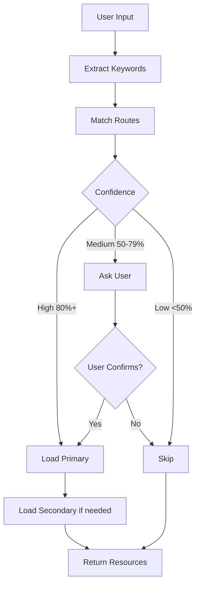

# Context Router

The Context Router is Evolving's intelligent resource loading system that maps user intent (via keywords) to relevant components, enabling context-efficient AI interactions.

## The Problem

Traditional approach: Load everything at session start

```
Session Start
    ↓
Load all rules (34K tokens)
Load all patterns (25K tokens)
Load all documentation (15K tokens)
    ↓
Total: 74K tokens used
Context: 37% full before user even speaks
```

## The Solution

Context Router: Load only what's needed, when needed

```
Session Start
    ↓
Load memory index (2K tokens)
Load active project (3K tokens)
    ↓
Total: 5K tokens used
Context: 2.5% full

User Request: "Debug this issue"
    ↓
Extract keywords: ["debug", "issue"]
Match route: "debugging"
    ↓
Load summaries (900 tokens)
    ↓
Total: 5.9K tokens
Context: 3% full
```

**Result:** 92% token savings

## Architecture

### Router File Structure

```json
{
  "version": "2.0",
  "routes": {
    "debugging": {
      "keywords": ["debug", "error", "fix", "bug"],
      "primary": {
        "patterns": ["systematic-debugging"],
        "rules": ["observe-before-editing"],
        "agents": ["debugger"]
      },
      "secondary": {
        "patterns": ["evidence-before-claims"],
        "rules": ["failure-recovery"]
      }
    }
  }
}
```

### Routing Flow



## Keyword Extraction

### Explicit Keywords

Direct matches from user input:

```
User: "I need to debug this error"
Keywords: ["debug", "error"]
Match: debugging route → 100% confidence
```

### Implicit Keywords

Derived from context:

```
User: "The login isn't working"
Implicit: ["bug", "fix", "investigate"]
Match: debugging route → 75% confidence
```

### Taxonomy Normalization

Unified keyword vocabulary:

```json
{
  "debug": {
    "synonyms": ["fix", "troubleshoot", "investigate"],
    "related": ["error", "bug", "issue"]
  }
}
```

```
User: "Troubleshoot the issue"
Normalized: ["debug", "issue"]
Match: debugging route
```

## Confidence Scoring

### Calculation

```python
base_confidence = 50

for keyword in user_keywords:
    if keyword in route.keywords:
        confidence += 10
    if keyword in route.secondary_keywords:
        confidence += 5

if multiple_routes_match:
    confidence -= 10

final_confidence = min(100, max(0, confidence))
```

### Thresholds

| Confidence | Action | Example |
|------------|--------|---------|
| **80-100%** | Auto-load primary | "debug" → debugging route |
| **50-79%** | Ask user | "improve" → could be refactoring OR optimization |
| **0-49%** | Skip route | "hello" → no technical route |

### Examples

**High Confidence (85%):**
```
User: "Debug the authentication error"
Keywords: ["debug", "error", "authentication"]
Route: debugging (primary match)
Action: Auto-load systematic-debugging, observe-before-editing
```

**Medium Confidence (65%):**
```
User: "Make this better"
Keywords: ["improve", "optimize"]
Routes: refactoring (60%), optimization (60%)
Action: Ask "Do you mean refactoring or performance optimization?"
```

**Low Confidence (30%):**
```
User: "What's the weather?"
Keywords: ["weather"]
Routes: (none match)
Action: Skip routing, respond directly
```

## Route Types

### 1. Pattern Routes

Load prompt patterns:

```json
{
  "route": "creative",
  "keywords": ["improve", "refine", "enhance"],
  "primary": {
    "patterns": ["reflection", "iterative-refinement"]
  }
}
```

### 2. Rule Routes

Load behavior rules:

```json
{
  "route": "code-modification",
  "keywords": ["edit", "change", "modify"],
  "primary": {
    "rules": ["observe-before-editing", "evidence-before-claims"]
  }
}
```

### 3. Agent Routes

Select specialists:

```json
{
  "route": "exploration",
  "keywords": ["find", "search", "explore"],
  "primary": {
    "agents": ["Explore"]
  }
}
```

### 4. Hybrid Routes

Combine resources:

```json
{
  "route": "debugging",
  "keywords": ["debug", "error"],
  "primary": {
    "patterns": ["systematic-debugging"],
    "rules": ["observe-before-editing"],
    "agents": ["debugger"]
  }
}
```

## Progressive Loading

### Layer 1: Detection (Always)

```json
{
  "route": "debugging",
  "confidence": 85,
  "load_type": "summary"
}
```

Cost: 0 tokens (cached in memory)

### Layer 2: Summary (High Confidence)

```json
{
  "pattern": "systematic-debugging",
  "summary": {
    "core_loop": "Reproduce → Evidence → Hypothesis → Test → Fix",
    "when_to_use": "Bug fixing, unexpected behavior",
    "key_points": [...]
  }
}
```

Cost: ~300 tokens per resource

### Layer 3: Full Docs (On Demand)

```markdown
# Systematic Debugging

## Core Loop
1. Reproduce issue consistently
2. Gather evidence (logs, stack traces)
3. Form hypothesis about root cause
4. Test hypothesis
5. Fix if confirmed
6. Verify fix

[... full documentation ...]
```

Cost: ~3K tokens per resource

### Example Flow

```
User: "Debug login error"
    ↓
Layer 1: Match "debugging" route (85% conf)
    ↓
Layer 2: Load summaries
  - systematic-debugging.json (300 tokens)
  - observe-before-editing.json (300 tokens)
    ↓
Total: 600 tokens

User: "I need more details on the debugging process"
    ↓
Layer 3: Load full doc
  - systematic-debugging.md (3K tokens)
    ↓
Total: 3.6K tokens
```

## Multi-Route Handling

### Route Intersection

When multiple routes match:

```
User: "Refactor and test this code"
Keywords: ["refactor", "test"]
    ↓
Routes matched:
  - refactoring (80%)
  - testing (75%)
    ↓
Action: Load both primary resources
  - refactoring-pattern
  - test-pattern
```

### Route Conflicts

Mutually exclusive routes:

```json
{
  "mutex_groups": [
    ["reflection", "react"],
    ["blackboard", "ensemble"]
  ]
}
```

```
User: "Use reflection and react"
    ↓
Conflict: Both in mutex_group
    ↓
Action: Ask user which to prefer
```

## Fallback Strategies

### No Route Match

```python
if no_routes_matched:
    # Fallback 1: Check command detection
    if command_detected:
        load_command()

    # Fallback 2: Use general-purpose agent
    elif delegation_score >= 3:
        delegate_to_general()

    # Fallback 3: Respond directly
    else:
        respond_directly()
```

### Partial Match

```python
if confidence < 50:
    # Load minimal context
    load_base_rules()

    # Proceed without pattern
    execute_task()
```

### Error Handling

```python
try:
    load_route_resources()
except ResourceNotFound:
    log_warning()
    continue_with_defaults()
```

## Route Configuration

### Adding a New Route

```json
{
  "routes": {
    "my-new-route": {
      "keywords": ["primary", "keywords"],
      "secondary_keywords": ["related", "terms"],
      "primary": {
        "patterns": ["pattern-name"],
        "rules": ["rule-name"],
        "agents": ["agent-name"]
      },
      "secondary": {
        "patterns": ["fallback-pattern"]
      },
      "confidence_boost": 10
    }
  }
}
```

### Updating Existing Routes

```json
{
  "routes": {
    "debugging": {
      "keywords": [
        "debug",
        "error",
        "fix",
        "troubleshoot"  // Added
      ]
    }
  }
}
```

## Performance Optimization

### Route Caching

```python
# Routes cached at session start
routes = load_json("context-router.json")

# Keyword extraction (fast)
keywords = extract(user_input)

# Matching (O(n) where n = routes)
matches = [r for r in routes if overlap(keywords, r.keywords)]

# Total: <10ms
```

### Lazy Loading

```python
# Don't load full docs until needed
summary = load_summary(pattern)

if need_more_detail:
    full_doc = load_full(pattern)
```

### Summary Pre-Generation

```bash
# Pre-generate summaries for fast access
scripts/generate-summaries.py

# Output: .claude/summaries/patterns/*.json
```

## Debugging Router Issues

### Check Route Match

```python
# Manual test
keywords = ["debug", "error"]
routes = check_routes(keywords)
print(routes)  # [{route: "debugging", confidence: 85}]
```

### Inspect Loaded Resources

```bash
# After routing
/context-stats

# Shows:
# - Routes matched
# - Resources loaded
# - Token usage
```

### Validate Router Config

```python
# Check for issues
validate_router("context-router.json")

# Reports:
# - Missing resources
# - Duplicate keywords
# - Invalid structure
```

## Best Practices

### DO

✅ **Use clear, specific keywords**
```json
{
  "keywords": ["debug", "error", "fix"]
}
```

✅ **Group related resources**
```json
{
  "primary": {
    "patterns": ["systematic-debugging"],
    "rules": ["observe-before-editing"]
  }
}
```

✅ **Add confidence boosts for strong signals**
```json
{
  "confidence_boost": 15
}
```

### DON'T

❌ **Use vague keywords**
```json
{
  "keywords": ["thing", "stuff", "work"]
}
```

❌ **Overload primary resources**
```json
{
  "primary": {
    "patterns": ["p1", "p2", "p3", "p4", "p5"]  // Too many
  }
}
```

❌ **Ignore confidence thresholds**
```python
# Bad: Load everything regardless
if confidence > 0:
    load_all()
```

## Next Steps

- [Memory System](memory-system.md) - Persistent state
- [Knowledge Graph](knowledge-graph.md) - Entity relationships
- [Agent Orchestration](agent-orchestration.md) - Delegation
- [Using Patterns](../guides/using-patterns.md) - Apply patterns
