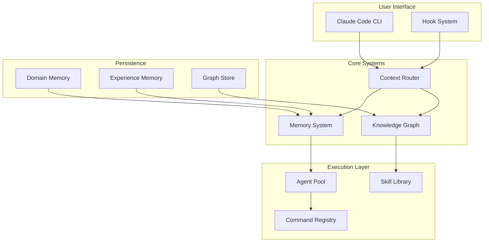
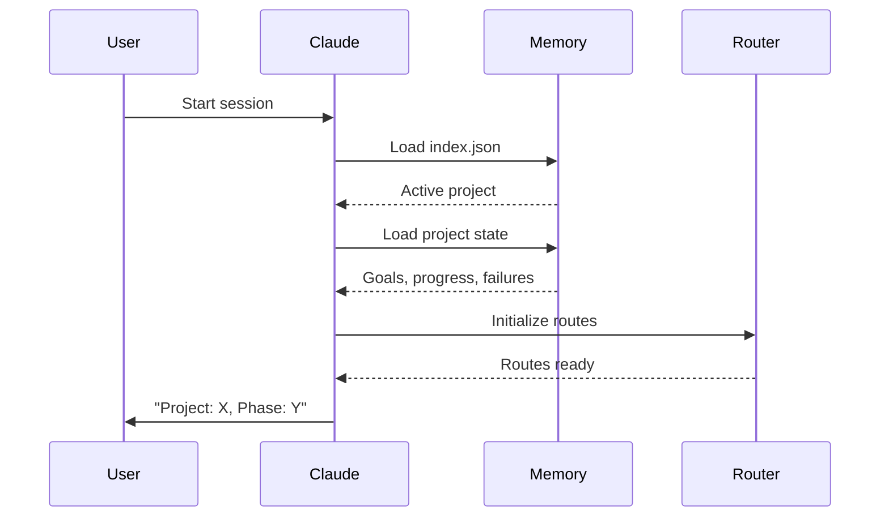
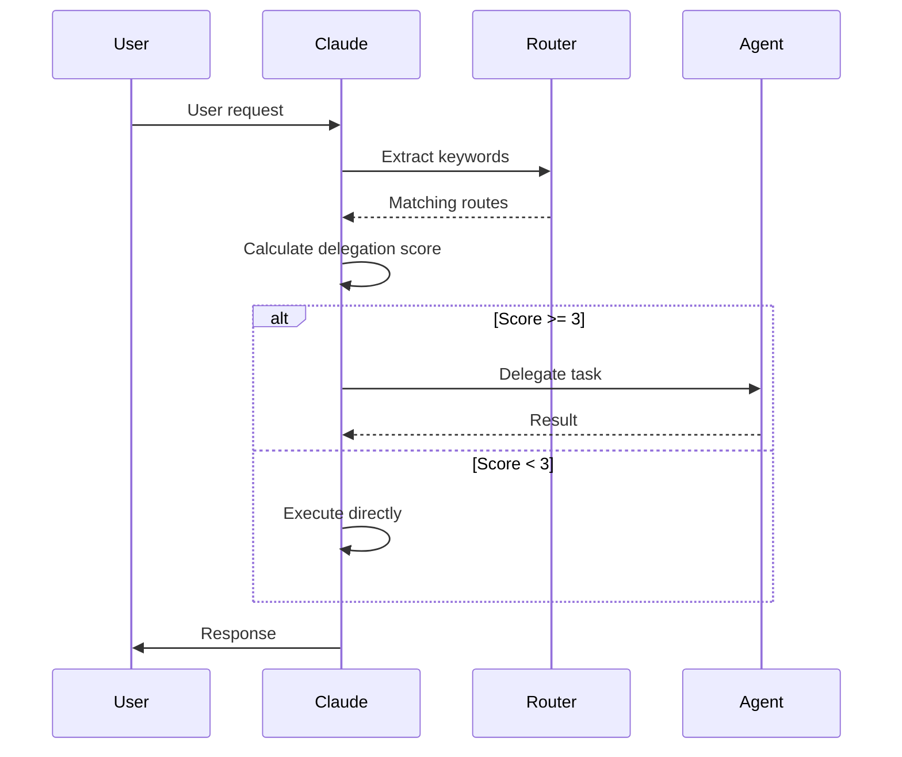

# Architecture

Understanding the Evolving architecture helps you leverage its full potential and extend it effectively.

## System Overview



## Core Components

### Memory System

The memory system provides persistent state across sessions:

| Component | Scope | Purpose |
|-----------|-------|---------|
| **Domain Memory** | Project | Active state, progress, failures |
| **Experience Memory** | Global | Learned solutions with decay |
| **Workflow State** | Session | Active workflow tracking |

[Learn more about the Memory System →](memory-system.md)

### Knowledge Graph

A network of interconnected entities:

- **360+ Nodes** - Components, concepts, resources
- **616+ Edges** - Relationships between nodes
- **Taxonomy** - Unified keyword vocabulary

[Learn more about the Knowledge Graph →](knowledge-graph.md)

### Context Router

Maps keywords to relevant resources:

```json
{
  "route": "debugging",
  "keywords": ["debug", "error", "fix", "bug"],
  "primary": ["systematic-debugging", "observe-before-editing"],
  "secondary": ["failure-recovery", "evidence-before-claims"]
}
```

[Learn more about Context Routing →](context-routing.md)

### Agent Orchestration

Coordinated multi-agent execution:

1. **Task Analysis** - Determine delegation score
2. **Agent Selection** - Match task to specialist
3. **Execution** - Run with appropriate model
4. **Verification** - Validate results

[Learn more about Agent Orchestration →](agent-orchestration.md)

## Data Flow

### Session Startup



### Request Processing



## File Structure

```
evolving/
├── .claude/
│   ├── agents/         # 68 agent definitions
│   ├── commands/       # 80 command definitions
│   ├── skills/         # 13 skill definitions
│   ├── rules/          # Core rules (auto-loaded)
│   ├── hooks/          # 22 hook scripts
│   ├── blueprints/     # 10 blueprints
│   ├── templates/      # 9 templates
│   └── scenarios/      # 8 scenarios
├── _memory/
│   ├── index.json      # Active context
│   ├── projects/       # Project-specific memory
│   ├── experiences/    # Learned solutions
│   └── workflows/      # Active workflows
├── _graph/
│   ├── knowledge-nodes.json
│   ├── edges.json
│   ├── taxonomy.json
│   └── cache/
│       └── context-router.json
├── knowledge/
│   ├── patterns/       # 59 patterns
│   ├── learnings/      # 54 learnings
│   ├── rules/          # Extended rules
│   └── graphics/       # Graphics tools
└── docs/               # This documentation
```

## Extension Points

### Adding Components

1. **Agents** - Add to `.claude/agents/`
2. **Commands** - Add to `.claude/commands/`
3. **Patterns** - Add to `knowledge/patterns/`
4. **Rules** - Add to `knowledge/rules/staging/`

### Integration Matrix

When adding components, update:

| File | Purpose |
|------|---------|
| `_stats.json` | Component counts |
| `context-router.json` | Keyword routing |
| `knowledge-nodes.json` | Graph node |
| `edges.json` | Relationships |
| `SYSTEM-MAP.md` | Documentation |

## Design Principles

1. **Context Efficiency** - Load only what's needed
2. **Fail Gracefully** - Handle missing data
3. **Self-Documenting** - Components describe themselves
4. **Composable** - Mix and match capabilities
5. **Observable** - Track what's happening

## Further Reading

- [Memory System](memory-system.md) - Deep dive into persistence
- [Knowledge Graph](knowledge-graph.md) - Entity relationships
- [Context Routing](context-routing.md) - Keyword mapping
- [Agent Orchestration](agent-orchestration.md) - Multi-agent coordination
