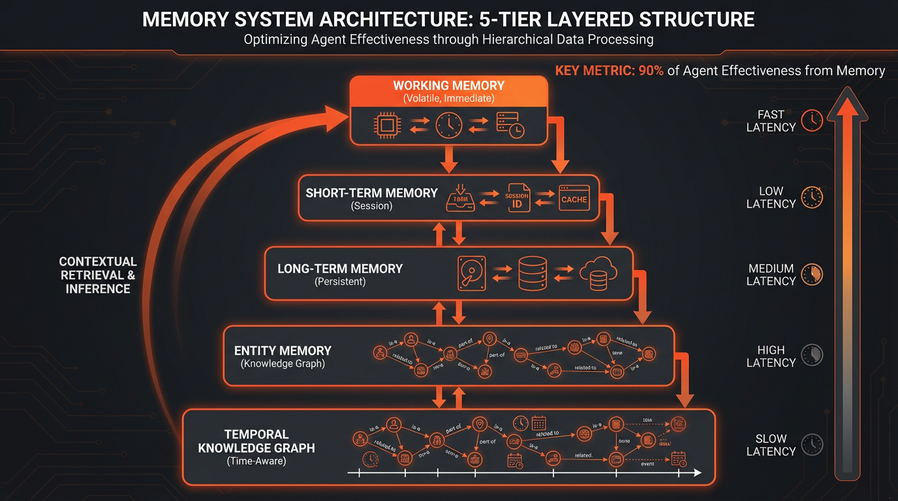
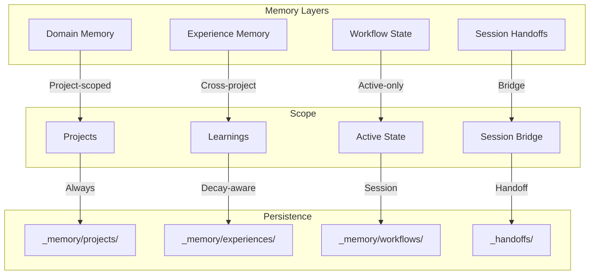

# Memory System

The memory system provides persistent, structured state management across sessions, enabling the system to learn, adapt, and maintain context over time.



## Memory Types



## 1. Domain Memory

**Location**: `_memory/projects/{project-name}.json`

Project-specific state that persists across sessions.

### Schema

```json
{
  "id": "evolving-system",
  "name": "Evolving System",
  "description": "Self-improving Claude Code configuration",
  "goals": ["Maintain system health", "Enable AI-first development"],
  "state": {
    "current_phase": "Intelligence System v3.3.0",
    "blockers": [],
    "active_workflows": []
  },
  "features": [
    {
      "name": "Domain Memory",
      "status": "passing",
      "last_tested": "2026-01-08"
    }
  ],
  "progress": [
    {
      "date": "2026-01-08",
      "action": "Implemented hydrate pattern",
      "result": "Single-call context loading",
      "next": "Test multi-project memory"
    }
  ],
  "failures": [
    {
      "date": "2026-01-07",
      "what": "Memory not loaded at session start",
      "why": "Missing bootup rule enforcement",
      "learned": "Make bootup CRITICAL priority"
    }
  ]
}
```

### Key Concepts

| Field | Purpose | Update Frequency |
|-------|---------|------------------|
| `goals` | High-level objectives | Rarely (project scope change) |
| `state.current_phase` | Active work phase | Per phase transition |
| `features` | Feature status tracking | Per feature completion/test |
| `progress` | Atomic progress entries | Per significant action |
| `failures` | Known issues & learnings | Per failure occurrence |

### Hydrate Pattern

Single-call loading of all memory types at session start:

```
Session Start
     │
     ▼
┌─────────────────────────────────┐
│ HYDRATE (Parallel Read)         │
│                                 │
│ 1. index.json → active project  │
│ 2. projects/{active}.json       │
│ 3. experiences/ (decay-filtered)│
│ 4. workflows/active.json        │
└──────────────┬──────────────────┘
               │
               ▼
         Merged Context
```

## 2. Experience Memory

**Location**: `_memory/experiences/{type}-{slug}-{date}.json`

Cross-project learnings with decay-aware relevance.

### Schema

```json
{
  "id": "solution-supabase-rls-20260108",
  "type": "solution",
  "title": "Supabase RLS Policy Debugging",
  "summary": "Use auth.uid() not user_id for RLS policies",
  "tags": ["supabase", "auth", "rls", "debugging"],
  "projects": ["auswanderungs-ki-v2"],
  "created": "2026-01-08T14:30:00Z",
  "metadata": {
    "base_relevance": 80,
    "decay_rate": 0.95,
    "trust_level": "high",
    "valid_until": null,
    "spaced_rep": {
      "interval_days": 7,
      "next_review": "2026-01-15T00:00:00Z",
      "review_count": 0
    }
  },
  "content": {
    "problem": "RLS policies failing silently",
    "solution": "Use auth.uid() instead of user_id column",
    "why": "user_id is NULL during policy evaluation",
    "when_to_use": "Any Supabase RLS policy"
  }
}
```

### Experience Types

| Type | Purpose | Decay Rate | Trust Level |
|------|---------|------------|-------------|
| `solution` | Problem-solution pairs | 0.95 | high |
| `pattern` | Reusable approaches | 0.98 | medium |
| `decision` | Architectural choices | 0.99 | high |
| `failure` | Known pitfalls | 0.90 | high |
| `optimization` | Performance improvements | 0.92 | medium |

### Decay System

Relevance decreases over time based on decay rate:

```
effective_relevance = base_relevance * (decay_rate ^ days_since_created) * trust_multiplier

WHERE trust_multiplier:
  - high: 1.0
  - medium: 0.8
  - low: 0.6
```

**Loading Filter**:
- Only load experiences with `effective_relevance > 30`
- Respect `valid_until` (temporal validity)
- Project-match OR high-relevance (>70)

### Spaced Repetition

Experiences use spaced repetition for reinforcement:

```json
{
  "spaced_rep": {
    "interval_days": 7,
    "next_review": "2026-01-15T00:00:00Z",
    "review_count": 2,
    "last_reviewed": "2026-01-08T10:00:00Z"
  }
}
```

**Interval Scaling**:
- `confirm`: interval × 2.5 (remembered well)
- `practice`: interval × 2.0 (needed practice)
- `skip`: interval × 0.8 (forgotten)

## 3. Workflow State

**Location**: `_memory/workflows/active.json`

Active workflow state (e.g., Plan execution, Interview).

### Schema

```json
{
  "workflow": "plan-execution",
  "plan_path": "knowledge/plans/v3-3-0-plan.md",
  "current_phase": 2,
  "current_task": "2.3",
  "checklist": {
    "1.1": "completed",
    "1.2": "completed",
    "2.1": "completed",
    "2.2": "completed",
    "2.3": "in_progress"
  },
  "delegation_log": [
    {
      "task": "1.1",
      "agent": "Explore",
      "model": "haiku",
      "result": "success"
    }
  ],
  "started": "2026-01-08T09:00:00Z",
  "last_updated": "2026-01-08T14:30:00Z"
}
```

**Lifecycle**:
1. Created when workflow starts (e.g., Plan execution)
2. Updated after each task completion
3. Deleted when workflow completes
4. Archived to Experience Memory if needed

## 4. Session Handoffs

**Location**: `_handoffs/YYYY-MM-DD-{description}.md`

Bridge between sessions with structured context transfer.

### Template

```markdown
# Handoff: {Description}

**Date**: YYYY-MM-DD HH:MM
**Project**: {project-name}
**Status**: {complete|partial|blocked}

---

## What Was Done

- Task 1: Description
- Task 2: Description

## Current State

- Feature X: passing
- Feature Y: in_progress

## Next Steps

1. High-priority task
2. Medium-priority task

## Known Issues

- Issue 1: Description + workaround
- Issue 2: Description

## Context for Next Session

Important decisions, caveats, or context needed.

---

## Files Changed

- `path/to/file1.ts` - what changed
- `path/to/file2.py` - what changed

## Commits

```bash
abc123f feat: Add feature X
def456g fix: Resolve issue Y
```
```

### Handoff Types

| Status | Meaning | Next Session |
|--------|---------|--------------|
| `complete` | All planned work done | Start fresh or review |
| `partial` | Some work done, more needed | Continue from "Next Steps" |
| `blocked` | Cannot proceed | Resolve blockers first |

## Memory Bootup Ritual

**Priority**: CRITICAL at session start

```
1. READ _memory/index.json
   → Extract: active_project, active_workflow

2. READ _memory/projects/{active}.json
   → Extract: goals, state, progress, failures

3. READ _memory/experiences/ (decay-filtered)
   → Load: relevant solutions, patterns, decisions

4. READ _graph/cache/context-router.json
   → Extract: routes for active domain

5. ANNOUNCE
   "Project: {name} | Phase: {phase}
    Last: {progress}
    Issues: {failures count}
    Experiences: {experiences count}
    Next: {next}"
```

### Continue Trigger

When user says "continue" after `/clear`:

```
1. LOAD latest handoff (ls -t _handoffs/*.md | head -1)
2. EXTRACT open tasks
3. LOAD plan if referenced
4. START immediately (no questions)
5. CREATE TodoWrite for open tasks
```

### Resume Trigger

When user says "resume {name}":

```
1. LOAD _memory/sessions/index.json
2. FIND session with name = "{name}"
3. LOAD handoff_file + project
4. RESTORE context
5. START immediately
```

## Memory Update Triggers

| Event | Action |
|-------|--------|
| Task completed | Progress entry |
| Feature finished | Feature status → passing |
| Error occurred | Failure entry |
| Phase changed | state.current_phase |
| Session end | Progress + next step |
| Learning extracted | Experience creation |

## Integration

### With Knowledge Graph

Memory and Graph work together:

```
Memory provides:
- Project state
- Recent learnings
- Known failures

Graph provides:
- Entity relationships
- Pattern connections
- Tool/command discovery
```

### With Context Router

Context Router uses Memory for smart loading:

```
1. User input → Keywords
2. Router matches → Routes
3. Memory + Graph → Relevant context
4. Progressive load → Summaries first
```

## Best Practices

### DO

- Update progress after EVERY significant action
- Log failures immediately with root cause
- Use Hydrate pattern for session-start loading
- Create handoffs for complex/interrupted work
- Apply decay filter when loading experiences

### DON'T

- Load all experiences (use effective_relevance filter)
- Skip memory bootup at session start
- Update memory only at session end
- Store session-local state in Domain Memory
- Create experiences for trivial learnings

## Related

- [Knowledge Graph](./knowledge-graph.md) - Entity-based context
- [Context Routing](./context-routing.md) - Smart loading
- [Agent Orchestration](./agent-orchestration.md) - Task coordination
- Domain memory bootup rules - Implementation details in internal project documentation
