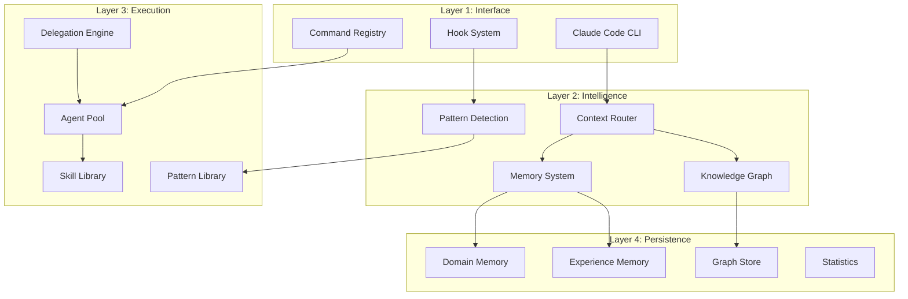
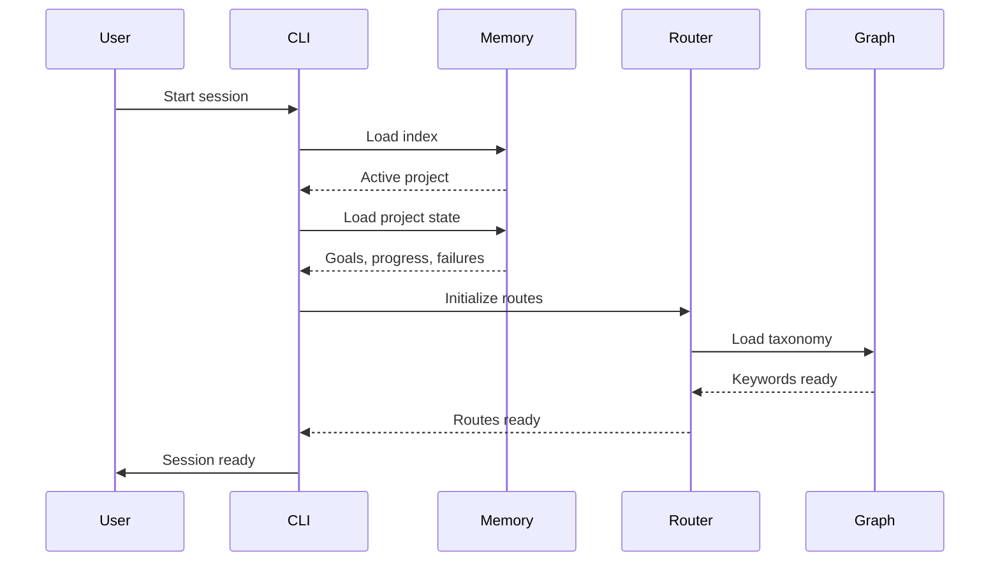
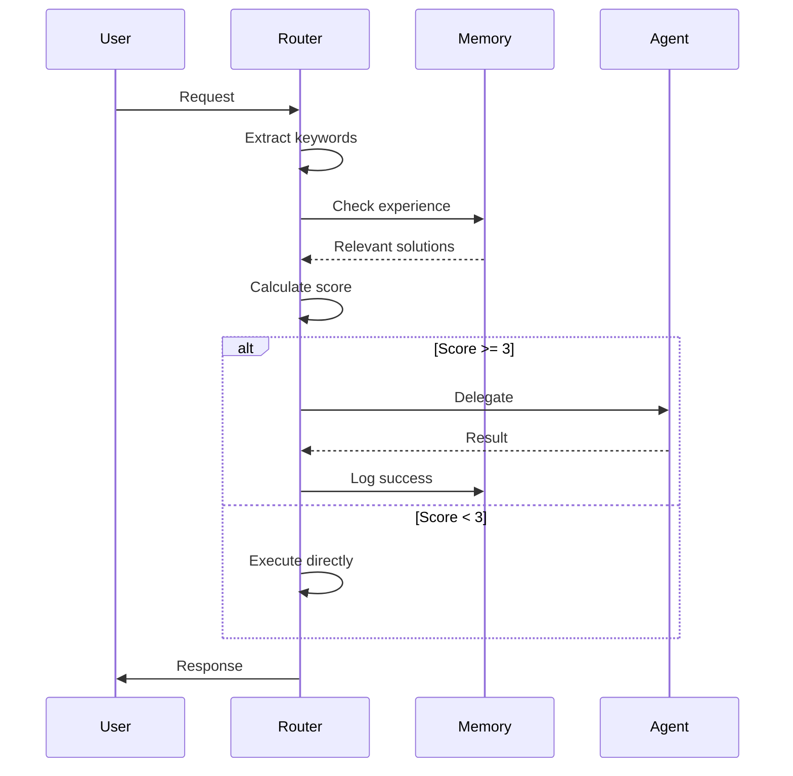

# Architecture Overview

The Evolving system is built on a layered architecture that separates concerns while maintaining flexibility and extensibility.

## Architecture Layers



## Core Systems

### 1. Memory System

Persistent state across sessions:

- **Domain Memory** - Project goals, progress, failures
- **Experience Memory** - Learned solutions with decay
- **Workflow State** - Active task tracking

[Deep dive: Memory System →](memory-system.md)

### 2. Knowledge Graph

Network of interconnected entities:

- **360+ Nodes** - Components and concepts
- **616+ Edges** - Relationships and dependencies
- **Taxonomy** - Unified keyword vocabulary

[Deep dive: Knowledge Graph →](knowledge-graph.md)

### 3. Context Router

Intelligent resource loading:

- **Keyword Extraction** - Understand user intent
- **Route Matching** - Find relevant resources
- **Confidence Scoring** - Decide what to load

[Deep dive: Context Routing →](context-routing.md)

### 4. Agent Orchestration

Multi-agent coordination:

- **Task Analysis** - Calculate delegation score
- **Agent Selection** - Match task to specialist
- **Parallel Execution** - Run independent tasks together
- **Result Synthesis** - Combine agent outputs

[Deep dive: Agent Orchestration →](agent-orchestration.md)

## Data Flow Patterns

### Session Initialization



### Request Processing



## Component Integration

### File System Layout

```
evolving/
├── .claude/              # Configuration layer
│   ├── agents/          # Agent definitions
│   ├── commands/        # Command definitions
│   ├── skills/          # Reusable skills
│   ├── rules/           # Behavior rules
│   ├── hooks/           # Event handlers
│   └── templates/       # Component templates
│
├── _memory/             # Persistence layer
│   ├── index.json      # Entry point
│   ├── projects/       # Domain memory
│   ├── experiences/    # Solution memory
│   └── analytics/      # Usage tracking
│
├── _graph/              # Knowledge layer
│   ├── knowledge-nodes.json
│   ├── edges.json
│   ├── taxonomy.json
│   └── cache/
│       └── context-router.json
│
└── knowledge/           # Resource layer
    ├── patterns/       # Prompt patterns
    ├── learnings/      # Extracted lessons
    ├── rules/          # Extended rules
    └── graphics/       # Visualization tools
```

### Integration Matrix

When adding components, update these files:

| Component | Stats | Router | Nodes | Edges | SYSTEM-MAP |
|-----------|:-----:|:------:|:-----:|:-----:|:----------:|
| Agent | ✅ | ✅ | ✅ | ✅ | ✅ |
| Command | ✅ | ✅ | ✅ | ✅ | ✅ |
| Skill | ✅ | ✅ | ✅ | ✅ | ✅ |
| Pattern | ✅ | ✅ | ✅ | ✅ | - |
| Rule | ✅ | ✅ | ✅ | - | ✅ |
| Hook | ✅ | - | - | - | ✅ |

## Design Principles

### 1. Progressive Disclosure

Load resources in layers:

```
Base (5K tokens)
  ↓ keyword match
Summary (300 tokens)
  ↓ need detail
Full (3K tokens)
```

**Result:** 90% token savings

### 2. Fail Gracefully

Handle missing data:

```python
try:
    load_resource()
except NotFound:
    use_default()
    continue
```

### 3. Self-Documenting

Components describe themselves:

```yaml
---
name: agent-name
description: What it does
capabilities: [list]
---
```

### 4. Composable

Mix and match:

```
Agent + Skill + Pattern = Capability
Command + Hook = Automation
Memory + Graph = Intelligence
```

## Extension Points

### Adding Agents

1. Create `.claude/agents/{name}.md`
2. Register in `_stats.json`
3. Add route in `context-router.json`
4. Create graph node
5. Update `SYSTEM-MAP.md`

[Guide: Creating Agents →](../guides/creating-agents.md)

### Adding Commands

1. Create `.claude/commands/{name}.md`
2. Add to detection index
3. Register in graph
4. Update documentation

[Guide: Writing Commands →](../guides/writing-commands.md)

### Adding Patterns

1. Create `knowledge/patterns/{name}.md`
2. Define keywords and triggers
3. Add to context router
4. Create summary file

[Guide: Using Patterns →](../guides/using-patterns.md)

## Performance Characteristics

### Memory Operations

| Operation | Time | Impact |
|-----------|------|--------|
| Session bootup | ~200ms | Load index + project |
| Context routing | ~50ms | Keyword match |
| Agent delegation | ~1-5s | Model-dependent |
| Graph query | ~10ms | In-memory lookup |

### Token Economics

| Scenario | Without System | With System | Savings |
|----------|---------------|-------------|---------|
| Session start | 34K tokens | 5K tokens | 85% |
| Simple task | 10K tokens | 2K tokens | 80% |
| Complex task | 50K tokens | 15K tokens | 70% |

### Scaling Limits

| Resource | Current | Practical Limit |
|----------|---------|-----------------|
| Agents | 68 | ~200 |
| Commands | 80 | ~300 |
| Graph nodes | 360 | ~1000 |
| Graph edges | 616 | ~3000 |

## Security Considerations

### Sandbox Execution

All code execution happens in controlled environments:

```python
# Agents cannot access:
- System files outside workspace
- Network without permission
- Credentials or secrets
```

### Memory Isolation

Projects are memory-isolated:

```json
{
  "project-a": {
    "goals": ["A-specific"]
  },
  "project-b": {
    "goals": ["B-specific"]
  }
}
```

### Hook Safety

Hooks have restricted permissions:

```bash
# Hooks can:
- Read files
- Analyze content
- Suggest actions

# Hooks CANNOT:
- Modify files directly
- Execute arbitrary code
- Bypass user confirmation
```

## Monitoring and Debugging

### System Health

Check system status:

```bash
/health-dashboard
```

Shows:
- Memory usage
- Active agents
- Hook status
- Graph integrity

### Analytics

Track usage:

```json
{
  "sessions": 156,
  "delegations": 423,
  "token_savings": "85%"
}
```

### Debugging Tools

```bash
# Context usage
/context-stats

# Component inventory
/inventory-report

# Memory state
/memory-status
```

## Next Steps

- [Memory System](memory-system.md) - Persistence details
- [Knowledge Graph](knowledge-graph.md) - Entity network
- [Context Routing](context-routing.md) - Resource loading
- [Agent Orchestration](agent-orchestration.md) - Multi-agent coordination
