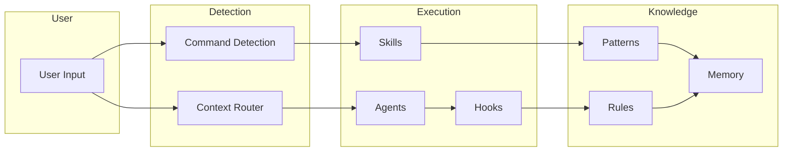

# Components

The Evolving system consists of **331+ components** organized into distinct types, each serving a specific purpose in the AI-First development workflow.

## Component Types

<div class="component-grid" markdown>

<div class="component-card" markdown>
### [Agents](agents/index.md)
**68 components**

Autonomous AI entities that perform specific tasks. From code review to security audits.
</div>

<div class="component-card" markdown>
### [Commands](commands/index.md)
**80 components**

User-invocable actions triggered by `/name` syntax. Quick access to common workflows.
</div>

<div class="component-card" markdown>
### [Skills](skills/index.md)
**13 components**

Specialized capabilities invoked on demand. Deep expertise in specific domains.
</div>

<div class="component-card" markdown>
### [Rules](rules/index.md)
**53 components**

Behavioral guidelines and constraints. Define how the system should behave.
</div>

<div class="component-card" markdown>
### [Hooks](hooks/index.md)
**22 components**

Event-triggered callbacks. Automate responses to specific actions.
</div>

<div class="component-card" markdown>
### [Patterns](patterns/index.md)
**59 components**

Reusable solution templates. Proven approaches to common problems.
</div>

<div class="component-card" markdown>
### [Blueprints](blueprints/index.md)
**10 components**

Complex structure templates. Create entire systems from templates.
</div>

<div class="component-card" markdown>
### [Templates](templates/index.md)
**9 components**

Content generation structures. Consistent formatting for various outputs.
</div>

</div>

## Statistics

| Metric | Value |
|--------|-------|
| **Total Components** | 331+ |
| **Knowledge Graph Nodes** | 360 |
| **Graph Edges** | 616 |
| **Context Routes** | 47 |

## How Components Work Together



## Finding Components

### By Type
Use the navigation to browse components by type.

### By Tag
Components are tagged with categories like:
- `orchestration` - Agent coordination
- `memory` - State persistence
- `automation` - Triggered behaviors
- `security` - Auditing and validation
- `graphics` - Visual content creation

### By Search
Use the search bar (top right) to find components by name or keyword.

### Via API
Access component metadata programmatically:

```bash
# All components
curl https://evolving.readthedocs.io/api/components.json

# Specific type
curl https://evolving.readthedocs.io/api/agents.json
```

## Component Lifecycle

1. **Discovery** - Found via Context Router or search
2. **Loading** - Metadata and content loaded into context
3. **Execution** - Component performs its function
4. **Tracking** - Results logged to Domain Memory

## Creating Components

See our guides for creating new components:

- [Creating Agents](../guides/creating-agents.md)
- [Writing Commands](../guides/writing-commands.md)
- [Extending the System](../guides/extending-system.md)
