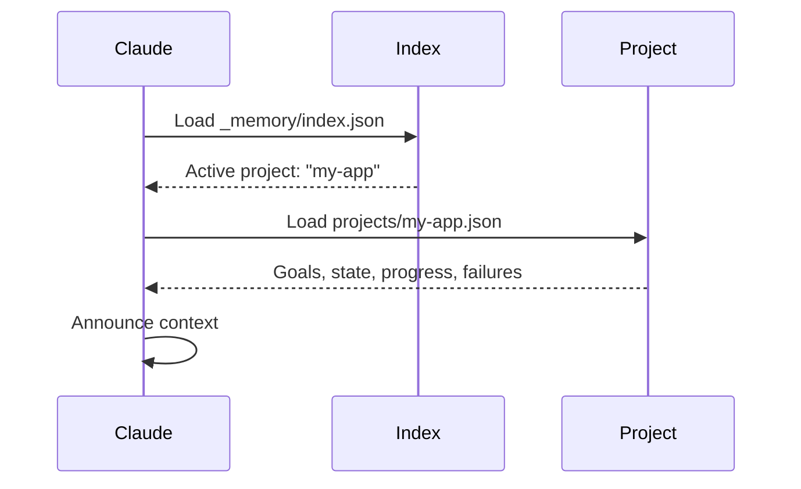
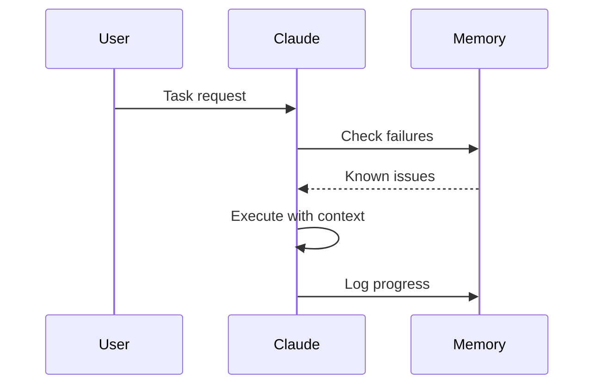
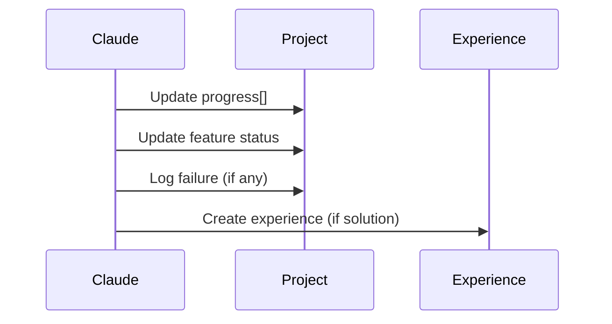

# Domain Memory

Domain Memory is Evolving's persistent project state system that maintains context across sessions, enabling the AI to remember goals, track progress, and learn from failures.

## What is Domain Memory?

Traditional AI assistants are stateless - they forget everything after each session. Domain Memory solves this by maintaining a persistent record of:

- **Project goals** and features
- **Current state** and phase
- **Progress history** with timestamps
- **Known failures** and their solutions

## Memory Structure

### Index File

`_memory/index.json` - The entry point

```json
{
  "active_context": {
    "project": "my-app",
    "workflow": null,
    "last_updated": "2025-01-15T14:30:00Z"
  },
  "projects": {
    "my-app": {
      "path": "projects/my-app.json",
      "last_accessed": "2025-01-15T14:30:00Z"
    }
  }
}
```

### Project Memory

`_memory/projects/my-app.json` - Project-specific state

```json
{
  "metadata": {
    "name": "my-app",
    "created": "2025-01-01T10:00:00Z",
    "description": "Full-stack app with auth and API"
  },
  "goals": [
    {
      "id": "auth",
      "description": "User authentication system",
      "status": "passing"
    },
    {
      "id": "api",
      "description": "RESTful API layer",
      "status": "in_progress"
    }
  ],
  "state": {
    "current_phase": "Implementation",
    "blocking_issues": []
  },
  "progress": [
    {
      "date": "2025-01-15",
      "action": "Implemented JWT authentication",
      "result": "passing",
      "next": "Add refresh token logic"
    }
  ],
  "failures": [
    {
      "date": "2025-01-14",
      "what": "RLS policy rejected valid user",
      "why": "Used wrong auth function",
      "learned": "Use auth.uid() not current_user_id()"
    }
  ]
}
```

## Session Lifecycle

### 1. Bootup (Session Start)



**What Claude says:**

```
"Project: my-app | Phase: Implementation
 Last progress: Implemented JWT auth (passing)
 Next step: Add refresh token logic
 Continue?"
```

### 2. Work (During Session)



**Memory checks:**
- Have we solved this before?
- Are there known failures to avoid?
- What's the current state?

### 3. Update (After Completion)



**Update examples:**

```json
// Progress entry
{
  "date": "2025-01-16",
  "action": "Added refresh token endpoint",
  "result": "passing",
  "next": "Add token rotation"
}

// Failure entry
{
  "date": "2025-01-16",
  "what": "Refresh token not persisted",
  "why": "Missing database column",
  "learned": "Always run migrations after schema changes"
}
```

## Memory Operations

### Reading Memory

Claude automatically reads memory at session start:

```python
# Automatic (bootup ritual)
READ _memory/index.json
READ _memory/projects/{active}.json

# Result: Full context loaded
```

### Writing Memory

After completing work:

```python
# Progress entry
project.progress.append({
  "date": "2025-01-16",
  "action": "What was done",
  "result": "Outcome",
  "next": "Suggested next step"
})

# Update feature status
project.goals[feature_id].status = "passing"

# Log failure (if applicable)
project.failures.append({
  "date": "2025-01-16",
  "what": "What went wrong",
  "why": "Root cause",
  "learned": "Lesson for next time"
})
```

### Querying Memory

Memory is checked for:

**Known failures:**
```python
if task_keywords_match(memory.failures):
  warn_user("We tried this before and it failed because...")
```

**Similar progress:**
```python
if similar_action_in_progress:
  suggest_approach("Last time we did X, which worked")
```

**Blocking issues:**
```python
if current_state.blocking_issues:
  alert("Known blockers: {issues}")
```

## Memory-Driven Decisions

### Feature Status

```json
{
  "id": "auth",
  "status": "passing"  // or "failing" or "in_progress"
}
```

**Impact:**
- `passing` → Can build on it
- `in_progress` → Complete it first
- `failing` → Fix before proceeding

### Phase Tracking

```json
{
  "current_phase": "Implementation"
}
```

**Phases:**
- `Planning` → Design decisions
- `Implementation` → Write code
- `Testing` → Verify functionality
- `Refinement` → Polish and optimize

### Next Steps

```json
{
  "next": "Add refresh token logic"
}
```

**Guides future sessions:**
- What to work on next
- Logical progression
- Prevents forgetting tasks

## Integration with Experience Memory

Domain Memory (project state) + Experience Memory (learned solutions) work together:

### Domain Memory

```json
{
  "failures": [
    {
      "what": "RLS policy issue",
      "learned": "Use auth.uid()"
    }
  ]
}
```

### Experience Memory

```json
{
  "type": "solution",
  "pattern": "RLS Policy Fix",
  "solution": "Use auth.uid() instead of current_user_id()",
  "confidence": 0.85,
  "effective_relevance": 75
}
```

**Workflow:**
1. Failure happens → Log in Domain Memory
2. Solution found → Create Experience
3. Similar issue → Query both memories
4. Apply learned solution

[Learn more about Experience Memory →](../architecture/memory-system.md#2-experience-memory)

## Best Practices

### DO

✅ **Update after every session**
```json
{
  "progress": [{
    "date": "2025-01-16",
    "action": "What you completed",
    "result": "Outcome",
    "next": "Next logical step"
  }]
}
```

✅ **Log failures with lessons**
```json
{
  "failures": [{
    "what": "Specific issue",
    "why": "Root cause",
    "learned": "What to do next time"
  }]
}
```

✅ **Track feature status**
```json
{
  "goals": [{
    "status": "passing"  // Update when complete
  }]
}
```

✅ **Suggest next steps**
```json
{
  "next": "Concrete actionable task"
}
```

### DON'T

❌ **Vague progress entries**
```json
{
  "action": "Did some work"  // Too generic
}
```

❌ **Skip failure logging**
```json
// User hits error, you fix it, but don't log
// Next session: Same error again!
```

❌ **Forget to update status**
```json
{
  "status": "in_progress"  // But actually done
}
```

❌ **Leave without next step**
```json
{
  "next": ""  // Next session: Where were we?
}
```

## Memory Patterns

### Continuation Pattern

```
Session 1:
  Progress: "Implemented auth service"
  Next: "Add tests"

Session 2 (Bootup):
  Claude: "Last time: Auth service done.
           Next step was: Add tests.
           Continue?"
```

### Failure Avoidance Pattern

```
Session 1:
  Failure: "RLS policy rejected user"
  Learned: "Use auth.uid()"

Session 2:
  User: "Add another RLS policy"
  Claude: "I'll use auth.uid() based on
           previous failure we logged."
```

### Phase Transition Pattern

```
Phase: Implementation → Testing

Claude checks:
  - All features "passing"?
  - No blocking issues?
  - Tests written?

If YES → Transition to "Refinement"
If NO → Stay in "Implementation"
```

## Memory Commands

### Manual Operations

```bash
# View current memory
/memory-status

# Switch project
/project-switch {name}

# Reset memory (careful!)
/memory-reset
```

### Automatic Operations

```python
# Session start
domain-memory-bootup.md → Load memory

# Task completion
Update progress[], features[], state

# Session end
session-summary.sh → Create handoff
```

## Troubleshooting

### Memory not loading?

Check:
1. Does `_memory/index.json` exist?
2. Is `active_context.project` set?
3. Does project file exist in `_memory/projects/`?

### Old data persisting?

```bash
# Check last_updated timestamp
cat _memory/index.json | jq '.active_context.last_updated'

# If stale, manually update or reset
```

### Multiple projects?

```json
{
  "projects": {
    "app-a": {...},
    "app-b": {...}
  }
}
```

Switch via `/project-switch` or update `active_context.project`

## Next Steps

- [Memory System Architecture](../architecture/memory-system.md) - Technical details
- [Experience Memory](../architecture/memory-system.md#2-experience-memory) - Learned solutions
- [Quick Start](../getting-started/quick-start.md) - Try it yourself
