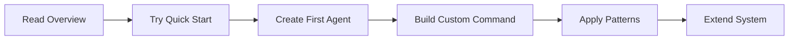

# Core Concepts

Understanding these core concepts will help you leverage the full power of the Evolving system.

## Foundation

The Evolving system is built on three pillars:

### Memory-Driven AI

Unlike traditional chatbots that forget everything between sessions, Evolving maintains persistent state:

- **Domain Memory** - Project goals, progress, and failures
- **Experience Memory** - Solutions that worked, with decay over time
- **Session Context** - Active workflow and current tasks

[Learn more about Memory Systems →](../architecture/memory-system.md)

### Context-Aware Routing

Load only what you need, when you need it:

- **Keyword Detection** - Extract intent from natural language
- **Confidence Scoring** - Decide what to load (high/medium/low)
- **Progressive Disclosure** - Start with summaries, load details on demand

[Learn more about Context Routing →](../architecture/context-routing.md)

### Agent Orchestration

Coordinate specialized AI workers for complex tasks:

- **Delegation** - Route tasks to the right specialist
- **Parallel Execution** - Run independent tasks simultaneously
- **Review Pipelines** - Automatic quality checks

[Learn more about Agent Orchestration →](../architecture/agent-orchestration.md)

## Key Concepts

### Domain Memory

Your project's persistent brain:

```json
{
  "project": "my-app",
  "current_phase": "Implementation",
  "goals": ["Feature A", "Feature B"],
  "progress": [
    {
      "date": "2025-01-15",
      "action": "Implemented auth service",
      "result": "passing",
      "next": "Add tests"
    }
  ]
}
```

[Deep dive into Domain Memory →](domain-memory.md)

### Prompt Patterns

Reusable approaches for common scenarios:

- **Reflection** - Iterative self-critique
- **React** - Reason + Act cycles
- **Tree of Thoughts** - Explore decision branches
- **Blackboard** - Multi-agent collaboration

[Learn about Prompt Patterns →](prompt-patterns.md)

### Knowledge Graph

A network of 360+ interconnected entities:

```
Command ──uses──> Agent ──implements──> Pattern
   │                │                      │
   └─triggers─> Hook └──────depends──> Rule
```

[Explore the Knowledge Graph →](../architecture/knowledge-graph.md)

### Context Router

Maps your intent to relevant resources:

```
User: "I need to debug this"
  ↓ Extract keywords: ["debug", "error"]
  ↓ Find routes: debugging
  ↓ Load: systematic-debugging, observe-before-editing
  ↓ Agent: debugger (sonnet)
```

[Learn about Context Routing →](../architecture/context-routing.md)

## Design Principles

### 1. Context Efficiency

Load only what's needed:

- **Session Start**: ~5K tokens (Memory + Index)
- **On Demand**: Load patterns/rules when keywords match
- **Progressive**: Summaries first, full docs if needed

### 2. Proactive Intelligence

The system anticipates needs:

- **Auto-Delegation** - Score ≥ 3 = delegate automatically
- **Hook System** - React to events (Write, Commit, Session-End)
- **Pattern Detection** - Recognize workflow triggers

### 3. Self-Improvement

Learn from interactions:

- **Correction Tracking** - User corrections become rules
- **Experience Memory** - Solutions with confidence decay
- **Auto-Learning** - Extract lessons from failures

### 4. Composability

Mix and match components:

- **Agents** can use **Skills**
- **Commands** invoke **Agents**
- **Patterns** combine **Rules**
- **Hooks** trigger **Workflows**

## Getting Started Path



1. **Understand** - [System Overview](overview.md)
2. **Practice** - [Quick Start Guide](../getting-started/quick-start.md)
3. **Create** - [Making Agents](../guides/creating-agents.md)
4. **Automate** - [Writing Commands](../guides/writing-commands.md)
5. **Scale** - [Extending System](../guides/extending-system.md)

## Quick Reference

### Memory Paths

```
_memory/
├── index.json              # Active context
├── projects/
│   └── {project}.json     # Domain memory
└── experiences/           # Solutions with decay
```

### Graph Files

```
_graph/
├── knowledge-nodes.json   # 360+ entities
├── edges.json            # 616+ relationships
├── taxonomy.json         # Unified keywords
└── cache/
    └── context-router.json
```

### Component Directories

```
.claude/
├── agents/       # 68 autonomous workers
├── commands/     # 80 user actions
├── skills/       # 13 reusable capabilities
├── rules/        # Core behavior
└── hooks/        # 22 event handlers
```

## Next Steps

- [System Overview](overview.md) - Understand the architecture
- [Domain Memory](domain-memory.md) - Deep dive into memory
- [Prompt Patterns](prompt-patterns.md) - Master patterns
- [Quick Start](../getting-started/quick-start.md) - Get hands-on
