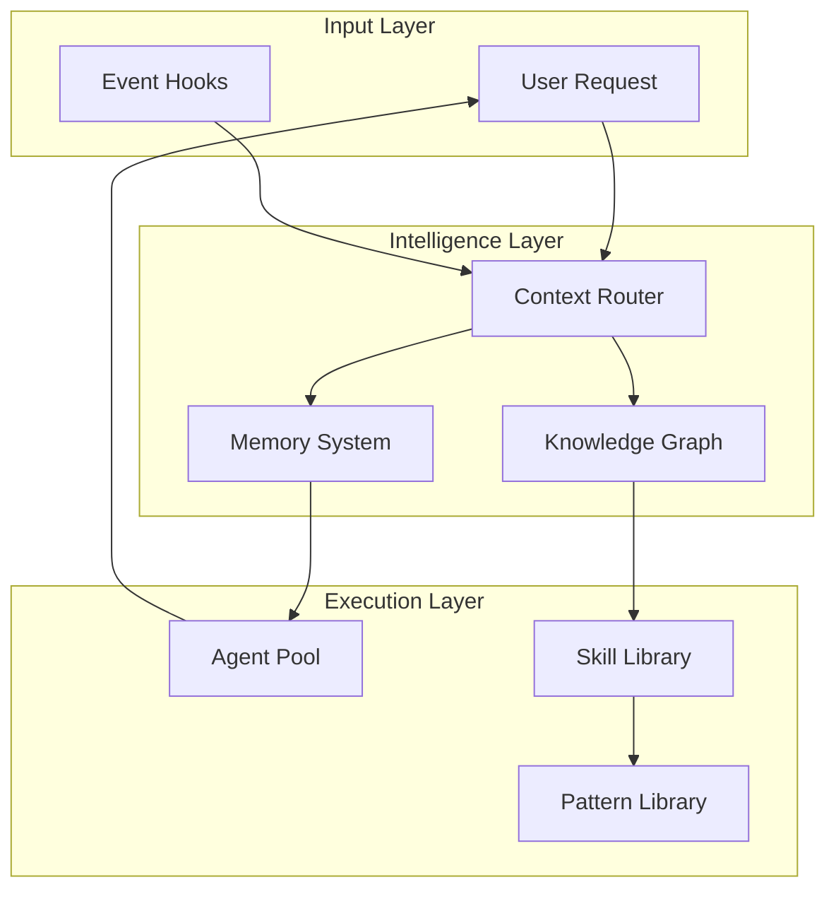
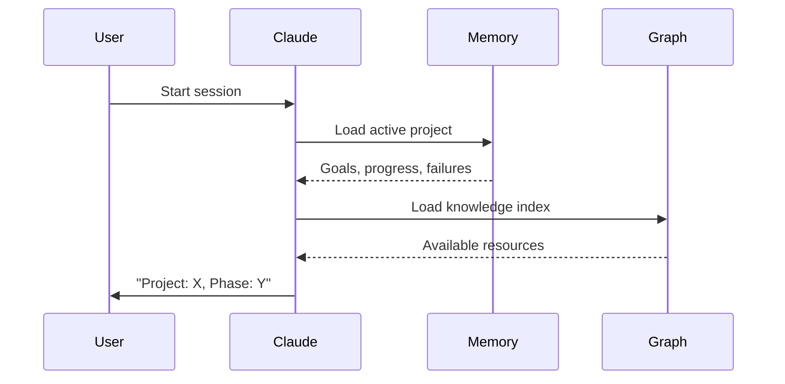
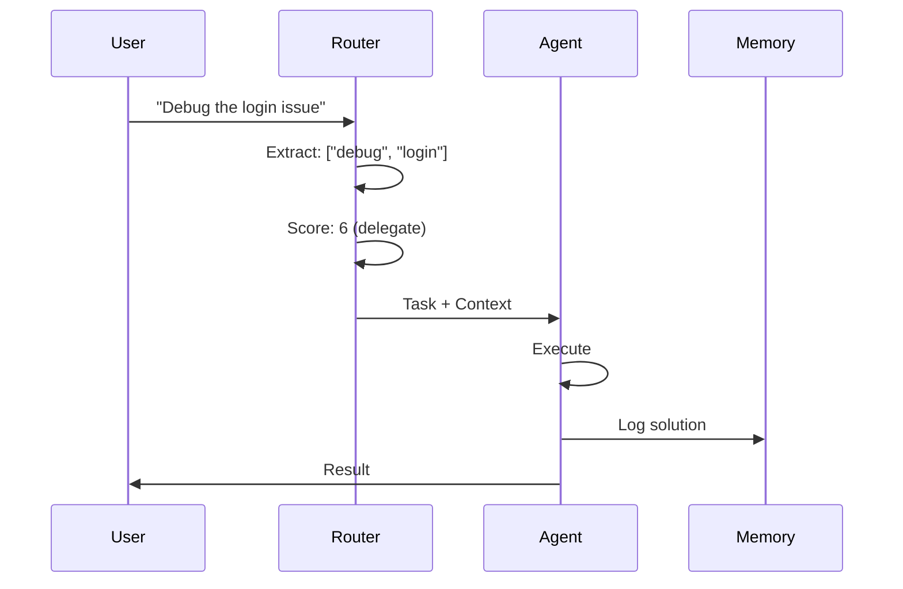

# System Overview

Evolving is a sophisticated AI assistant framework that maintains persistent state, learns from interactions, and intelligently routes context based on user intent.

## What Makes Evolving Different?

### Traditional AI Assistants

```
User: "Debug this issue"
AI: [Loads everything] → High context, slow
    [Forgets after session] → No learning
    [No specialization] → Generic responses
```

### Evolving

```
User: "Debug this issue"
AI: [Loads debugging context only] → Low context, fast
    [Remembers project state] → Builds on history
    [Delegates to specialist] → Expert response
```

## Core Architecture



## The Three Pillars

### 1. Memory System

Maintains context across sessions:

**Domain Memory** - Project-specific state
```json
{
  "project": "my-app",
  "current_phase": "Implementation",
  "goals": ["Auth", "API"],
  "progress": [
    {"action": "Setup", "result": "done"}
  ],
  "failures": []
}
```

**Experience Memory** - Learned solutions
```json
{
  "pattern": "RLS Policy Fix",
  "solution": "Use auth.uid() instead of current_user_id()",
  "confidence": 0.85,
  "decay_factor": 0.95,
  "last_used": "2025-01-15"
}
```

[Learn more about Memory →](../architecture/memory-system.md)

### 2. Context Router

Maps keywords to resources:

```
Keywords: ["debug", "error"]
    ↓
Route: debugging
    ↓
Load:
  - Rules: observe-before-editing
  - Patterns: systematic-debugging
  - Agents: debugger
```

**Benefits:**
- Load 5K tokens instead of 34K
- Get relevant resources only
- Faster response times

[Learn more about Routing →](../architecture/context-routing.md)

### 3. Agent Orchestration

Coordinate specialists:

```
Task: "Implement auth feature"
    ↓
Delegation Score: 7 (multi-file, complex)
    ↓
Agents:
  - code-architect (design)
  - feature-dev (implementation)
  - code-reviewer (quality check)
```

[Learn more about Agents →](../architecture/agent-orchestration.md)

## Information Flow

### Session Startup



### Request Handling



## Component Ecosystem

### Agents (68)

Autonomous task executors:

- **Explore** - Search and analyze codebases
- **Debugger** - Systematic debugging
- **Code-Reviewer** - Quality checks
- **Type-Analyzer** - Type system design

[Guide: Creating Agents →](../guides/creating-agents.md)

### Commands (80)

User-invocable actions:

- `/health-dashboard` - System diagnostics
- `/whats-next` - Generate handoff
- `/review-plan` - Validate execution plan

[Guide: Writing Commands →](../guides/writing-commands.md)

### Patterns (59)

Reusable approaches:

- **Reflection** - Self-critique loops
- **React** - Reason + Act cycles
- **Systematic Debugging** - Evidence-based fixes

[Guide: Using Patterns →](../guides/using-patterns.md)

### Hooks (22)

Event-driven automation:

- **PreWrite** - Check before file modifications
- **PostCommit** - Sync documentation
- **SessionEnd** - Create handoffs

## Key Features

### Progressive Context Loading

```
Base Load (5K tokens)
    ↓
Keyword Match → Load Summaries (300 tokens each)
    ↓
Complex Case → Load Full Docs (3K tokens)
```

**Result:** 90% token savings

### Auto-Delegation

```
Task Analysis
    ↓
Score >= 3?
    ↓
YES → Task Tool (specialist agent)
NO → Execute directly
```

**Result:** Right capability for the job

### Self-Learning

```
User Correction
    ↓
Pattern Recognition
    ↓
Rule Generation (staged)
    ↓
3+ Successes → Production
```

**Result:** System improves over time

## File Structure

```
evolving/
├── .claude/              # System configuration
│   ├── agents/          # 68 agent definitions
│   ├── commands/        # 80 command definitions
│   ├── skills/          # 13 reusable skills
│   ├── rules/           # Core behavior rules
│   ├── hooks/           # 22 event handlers
│   ├── blueprints/      # 10 project templates
│   └── templates/       # 9 component templates
├── _memory/             # Persistent state
│   ├── index.json      # Active context
│   ├── projects/       # Domain memory
│   └── experiences/    # Learned solutions
├── _graph/              # Knowledge network
│   ├── knowledge-nodes.json  # 360+ entities
│   ├── edges.json           # 616+ relationships
│   ├── taxonomy.json        # Unified keywords
│   └── cache/
│       └── context-router.json
└── knowledge/           # Resource library
    ├── patterns/       # 59 patterns
    ├── learnings/      # 54 learnings
    └── rules/          # Extended rules
```

## Design Philosophy

### 1. Context is Precious

Only load what you need:
- Session start: minimal (~5K)
- On demand: targeted (300-3K)
- Progressive: summary → full

### 2. Specialize, Don't Generalize

Right tool for the job:
- Explore: haiku (fast, cheap)
- Implementation: sonnet (balanced)
- Complex reasoning: opus (deep)

### 3. Learn from Experience

Improve over time:
- Track what works
- Remember failures
- Extract patterns
- Generate rules

### 4. Fail Gracefully

Handle edge cases:
- Missing files → skip, continue
- Invalid data → use defaults
- Failed delegation → execute directly

## Getting Started

1. **Understand** - Read this overview
2. **Explore** - [Quick Start Guide](../getting-started/quick-start.md)
3. **Practice** - [Creating Agents](../guides/creating-agents.md)
4. **Master** - [System Extension](../guides/extending-system.md)

## Next Steps

- [Core Concepts](index.md) - Essential principles
- [Domain Memory](domain-memory.md) - Deep dive into memory
- [Prompt Patterns](prompt-patterns.md) - Master patterns
- [Architecture](../architecture/index.md) - Technical details
