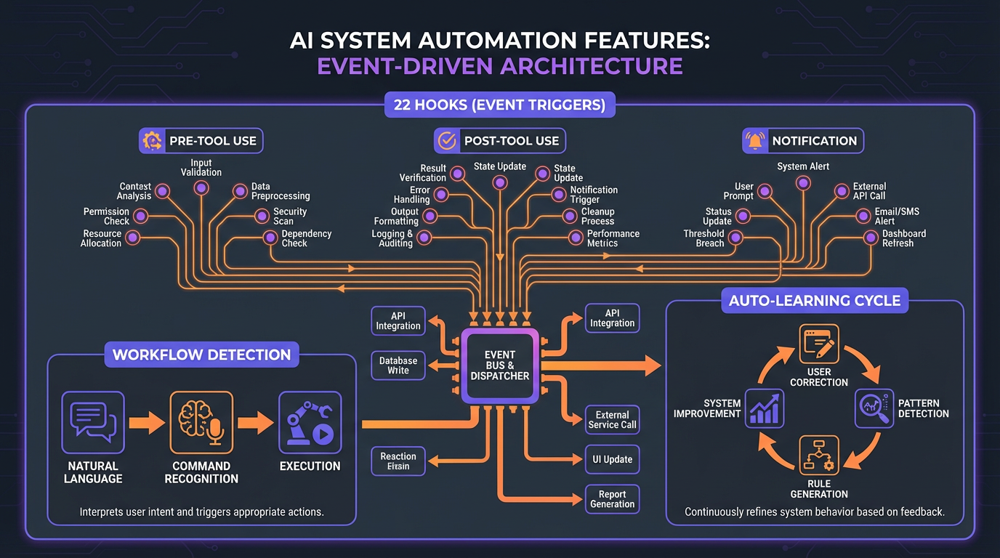

# Automation

Evolving automates repetitive workflows through hooks, natural language detection, self-learning, documentation sync, session evaluation, and spaced repetition.



---

## Hook System

### What It Does

Executes automated checks and actions at key lifecycle events (before/after tool use, session start/end).

### Hook Categories

**22 Active Hooks** in 4 categories:

| Category | Hooks | Purpose |
|----------|-------|---------|
| **Validation** (6) | check-comments, todo-enforcer, delegation-enforcer, etc. | Enforce quality standards |
| **Sync** (4) | auto-cross-reference, doc-sync, knowledge-sync | Keep docs consistent |
| **Analysis** (7) | correction-detector, context-warning, subagent-router, etc. | Detect patterns, suggest improvements |
| **Memory** (5) | session-summary, usage-tracker, experience-suggest, etc. | Track and learn |

### How It Works

```
Tool Execution (e.g., Write)
     │
     ▼
┌──────────────────────────┐
│ PreToolUse Hooks         │
│                          │
│ • todo-enforcer          │
│   (check open todos)     │
│                          │
│ • check-comments         │
│   (validate comment %)   │
└──────────┬───────────────┘
           │
           ▼
    Tool Executes
           │
           ▼
┌──────────────────────────┐
│ PostToolUse Hooks        │
│                          │
│ • auto-cross-reference   │
│   (sync docs)            │
│                          │
│ • delegation-enforcer    │
│   (track hints)          │
└──────────────────────────┘
```

### Configuration

**Location**: `.claude/hooks/`

**Hook Metadata**:
```json
{
  "name": "check-comments",
  "lifecycle": "PreToolUse",
  "tools": ["Write", "Edit"],
  "priority": 5,
  "config": {
    "max_comment_percentage": 25,
    "action_on_fail": "block"
  }
}
```

### Example

**Write Hook Flow**:
```
Claude: Edit("auth.ts", ...)
     │
     ▼
┌──────────────────────────┐
│ check-comments.py        │
│                          │
│ Analyzes code:           │
│ • Lines: 100             │
│ • Comments: 30           │
│ • Percentage: 30%        │
│                          │
│ → EXCEEDS 25% threshold  │
│ → BLOCK with message     │
└──────────┬───────────────┘
           │
           ▼
Claude receives:
  "⚠️ BLOCK: 30% comments (max 25%)
   Refactor: Use self-documenting code"

Claude must:
  → Reduce comments
  → Re-attempt Write
  → Hook passes → Write succeeds
```

**Session End Hook**:
```
Session ending
     │
     ▼
┌──────────────────────────┐
│ session-summary.sh       │
│                          │
│ Creates handoff if:      │
│ • Commits made, OR       │
│ • Handoff created        │
│                          │
│ Otherwise: Skip          │
└──────────┬───────────────┘
           │
           ▼
Handoff created:
  _handoffs/2026-02-03-feature-x.md
```

**Related**: `.claude/hooks/README.md`

---

## Workflow Detection

### What It Does

Recognizes workflow triggers from natural language input and suggests appropriate commands.

### How It Works

```
User: "I have a new idea"
     │
     ▼
┌──────────────────────────┐
│ 1. Keyword Extraction    │
│    ["new", "idea"]       │
└──────────┬───────────────┘
           │
           ▼
┌──────────────────────────┐
│ 2. Detection Index Match │
│    .claude/detection-    │
│    index.json            │
│                          │
│    Match: /idea-new      │
│    Confidence: 95%       │
└──────────┬───────────────┘
           │
           ▼
┌──────────────────────────┐
│ 3. Confidence Check      │
│                          │
│ ≥ 80%: Suggest command   │
│ 50-79%: Ask if meant     │
│ < 50%: Ignore            │
└──────────┬───────────────┘
           │ 95% (HIGH)
           ▼
┌──────────────────────────┐
│ 4. User Prompt           │
│                          │
│ "Soll ich /idea-new      │
│  nutzen?"                │
│                          │
│ Wait for confirmation    │
└──────────────────────────┘
```

### Configuration

**Detection Index**: `.claude/detection-index.json`

```json
{
  "commands": [
    {
      "command": "/idea-new",
      "keywords": ["idea", "new", "brainstorm"],
      "patterns": [
        "I have a(n)? (new )?idea",
        "brainstorm(ing)?",
        "let's think about"
      ],
      "confidence_base": 80,
      "anti_keywords": ["old", "previous", "existing"]
    }
  ]
}
```

### Example

**High Confidence (95%)**:
```
User: "I have a new idea for authentication"

System:
  → Keywords: ["new", "idea"]
  → Pattern match: "I have a new idea"
  → Confidence: 95%
  → Suggests: "Soll ich /idea-new nutzen?"

User: "yes"

System:
  → Executes /idea-new workflow
```

**Medium Confidence (65%)**:
```
User: "Maybe we should plan this better"

System:
  → Keywords: ["plan"]
  → No exact pattern match
  → Confidence: 65%
  → Asks: "Meinst du /plan?"

User: "no, just thinking out loud"

System:
  → Continues normal conversation
```

**Low Confidence (30%)**:
```
User: "The plan seems good"

System:
  → Keywords: ["plan"]
  → Context: not a request
  → Confidence: 30%
  → No suggestion (responds normally)
```

**Related**: `.claude/rules/workflow-detection.md`

---

## Auto-Learning

### What It Does

Generates new rules from user corrections, storing them as candidates for manual review and promotion.

### How It Works

```
User Corrects Claude
     │
     ▼
┌──────────────────────────┐
│ 1. Hook Detection        │
│    correction-detector.py│
│                          │
│    Recognizes:           │
│    • assumption errors   │
│    • scope issues        │
│    • over-engineering    │
│    • misunderstandings   │
└──────────┬───────────────┘
           │
           ▼
┌──────────────────────────┐
│ 2. Suggestion            │
│                          │
│ "💡 This could be a rule!│
│  Category: assumption    │
│  Create rule?"           │
└──────────┬───────────────┘
           │
     User confirms?
      /          \
    YES           NO
     │             │
     ▼             ▼
  Generate       Skip
     │
     ▼
┌──────────────────────────┐
│ 3. Context Extraction    │
│                          │
│ • Last 3-5 turns         │
│ • Original action        │
│ • Corrected action       │
│ • Category from hook     │
└──────────┬───────────────┘
           │
           ▼
┌──────────────────────────┐
│ 4. Rule Generation       │
│                          │
│ Template:                │
│ • Title                  │
│ • Category               │
│ • Pattern (do)           │
│ • Anti-pattern (don't)   │
│ • Example                │
└──────────┬───────────────┘
           │
           ▼
┌──────────────────────────┐
│ 5. Save as CANDIDATE     │
│                          │
│ knowledge/rules/staging/ │
│ {category}-{slug}-       │
│ {date}.md                │
│                          │
│ Status: candidate        │
│ Confidence: 30           │
└──────────────────────────┘
```

### Configuration

**No configuration** - triggered by correction-detector.py hook.

**Rule Lifecycle**:
```
candidate (manual review needed)
     │
     │ /rules-review promote {id}
     ▼
trial (loaded, passive tracking)
     │
     │ 3+ successful applications
     ▼
stable (production)
```

### Example

**Correction Scenario**:
```
Claude: [Reads file without checking if exists]
        Read("config.json")

Error: File not found

User: "Check if file exists first with ls!"

System:
  → correction-detector.py triggers
  → Category: assumption
  → Suggests: "💡 Create rule?"

User: "yes"

System generates:
  File: assumption-check-file-exists-20260203.md
  Title: "Verify file existence before reading"
  Pattern: "Use ls/glob to check file exists"
  Anti-pattern: "Assume file exists based on memory"
  Example: [Concrete example from conversation]
  Status: candidate
```

**Manual Review**:
```
User: "/rules-review list --status=CANDIDATE"

System shows:
  1. assumption-check-file-exists-20260203
     Applied: 0 times
     Age: 1 day

User: "/rules-review promote 1"

System:
  → Status: candidate → trial
  → Will load at next session start
  → Begins passive tracking
```

**Trial to Stable**:
```
Session 1: Rule applied, no correction → success_count: 1
Session 2: Rule applied, no correction → success_count: 2
Session 3: Rule applied, no correction → success_count: 3

Automatic promotion:
  → Status: trial → stable
  → Moved to knowledge/rules/debugging/
  → Now part of core system
```

**Related**: `.claude/rules/auto-rule-generation.md`

---

## Doc Sync

### What It Does

Automatically updates master documentation (README, SYSTEM-MAP, COMMANDS) when structural changes occur.

### How It Works

```
Structural Change
(Command/Agent/Pattern created)
     │
     ▼
┌──────────────────────────┐
│ 1. Hook Detection        │
│    auto-cross-reference  │
│    .sh                   │
│                          │
│ "⚠️ SYNC CHECK: Command" │
└──────────┬───────────────┘
           │
           ▼
┌──────────────────────────┐
│ 2. Decision              │
│                          │
│ Documentable change?     │
│ • New component? ✓       │
│ • Changed counts? ✓      │
│ • Just bugfix? ✗         │
└──────────┬───────────────┘
           │ YES
           ▼
┌──────────────────────────┐
│ 3. Update Master Docs    │
│                          │
│ • COMMANDS.md (+entry)   │
│ • README.md (+count)     │
│ • SYSTEM-MAP.md (+entry) │
│ • detection-index.json   │
└──────────┬───────────────┘
           │
           ▼
┌──────────────────────────┐
│ 4. Single Commit         │
│                          │
│ "docs: Add /new-command  │
│  to master documents"    │
└──────────────────────────┘
```

### Configuration

**Hook Location**: `.claude/hooks/auto-cross-reference.sh`

**Sync Matrix**:

| Change Type | Updates |
|-------------|---------|
| Command | COMMANDS.md, README.md, SYSTEM-MAP.md, detection-index.json |
| Agent | SYSTEM-MAP.md, README.md |
| Pattern | SYSTEM-MAP.md, README.md, knowledge/index.md |
| Template | SYSTEM-MAP.md, README.md, knowledge/index.md |

### Example

**New Command Created**:
```
Write(.claude/commands/new-feature.md)
     │
     ▼
Hook triggers:
  "⚠️ SYNC CHECK: Command - new-feature.md"

Claude automatically:
  1. Reads COMMANDS.md → current count: 47
  2. Adds entry:
     ## /new-feature
     **Category**: Feature Development
     **Description**: ...
  3. Updates count: 47 → 48
  4. Updates SYSTEM-MAP.md commands table
  5. Updates README.md count
  6. Updates detection-index.json with keywords
  7. Commits: "docs: Add /new-feature to master documents"
  8. Informs user: "Master docs updated for /new-feature"
```

**No User Intervention Needed** - completely automatic.

**Related**: `.claude/rules/proactive-doc-sync.md`

---

## Session Evaluation

### What It Does

Evaluates completed sessions using a 5-criteria rubric, storing results in Experience Memory.

### How It Works

```
Session Start
     │
     ▼
┌──────────────────────────┐
│ Check for Unrated        │
│ Sessions                 │
│                          │
│ knowledge/sessions/      │
│ *pending*.md             │
└──────────┬───────────────┘
           │
   Found pending?
      /         \
    YES          NO
     │            │
     ▼            ▼
  Offer        Continue
  Evaluation   Normally
     │
     ▼
┌──────────────────────────┐
│ User Accepts?            │
│                          │
│ "3 unrated sessions.     │
│  Quick eval? (30s each)" │
└──────────┬───────────────┘
           │ YES
           ▼
┌──────────────────────────┐
│ For Each Session:        │
│                          │
│ 1. Read session file     │
│ 2. Read commits          │
│ 3. Read handoff          │
│                          │
│ 4. Rate 5 criteria:      │
│    • Completeness (20%)  │
│    • Depth (25%)         │
│    • Tone (15%)          │
│    • Scope (20%)         │
│    • Missed Opp. (20%)   │
│                          │
│ 5. Calculate score       │
│    (weighted average)    │
└──────────┬───────────────┘
           │
           ▼
┌──────────────────────────┐
│ Save to Experience       │
│                          │
│ MCP: experience_create   │
│ • type: session_eval     │
│ • scores: {...}          │
│ • overall: 4.2/5         │
│ • strengths: [...]       │
│ • weaknesses: [...]      │
└──────────┬───────────────┘
           │
           ▼
┌──────────────────────────┐
│ Cleanup                  │
│                          │
│ Delete session file      │
│ (data in Experience now) │
└──────────────────────────┘
```

### Configuration

**Rubric Weights**:
```json
{
  "criteria": {
    "completeness": 0.20,
    "depth": 0.25,
    "tone": 0.15,
    "scope": 0.20,
    "missed_opportunities": 0.20
  },
  "thresholds": {
    "excellent": 4.0,
    "good": 3.5,
    "needs_improvement": 3.0
  }
}
```

### Example

**Evaluation Flow**:
```
Session: 2026-02-03 (Feature Implementation)

Commits: 3
Files changed: 5
Handoff: Created

Evaluation:
  Completeness: 5/5 (all tasks done)
  Depth: 4/5 (thorough, could add more tests)
  Tone: 5/5 (professional, clear)
  Scope: 4/5 (stayed focused, minor scope creep)
  Missed Opportunities: 3/5 (could have refactored adjacent code)

Weighted Score:
  (5×0.20) + (4×0.25) + (5×0.15) + (4×0.20) + (3×0.20)
  = 1.0 + 1.0 + 0.75 + 0.8 + 0.6
  = 4.15/5

Experience saved:
  type: session_eval
  overall: 4.15
  summary: "Good feature work, focused execution"
  strengths: ["Complete", "Good tone", "Stayed on track"]
  weaknesses: ["Could improve adjacent code", "More tests needed"]

Session file deleted (data preserved in Experience)
```

**Score-Based Actions**:

| Score | Action |
|-------|--------|
| 4.0-5.0 | Log only |
| 3.0-3.9 | Offer: "Extract learning?" |
| < 3.0 | Proactively suggest learning |

**Related**: `.claude/rules/session-evaluation.md`

---

## Spaced Repetition

### What It Does

Schedules reviews of experiences and rules using spaced repetition algorithm to reinforce learning.

### How It Works

```
Experience Created
     │
     │ interval: 3 days
     ▼
┌──────────────────────────┐
│ First Review             │
│                          │
│ "Remember this solution?"│
│                          │
│ [C]onfirm / [S]kip       │
└──────────┬───────────────┘
           │
     User: Confirm
           │
           ▼
┌──────────────────────────┐
│ Update Interval          │
│                          │
│ interval *= 2.5          │
│ 3 days → 7.5 days        │
└──────────┬───────────────┘
           │
     7.5 days later
           │
           ▼
┌──────────────────────────┐
│ Second Review            │
│                          │
│ User: Confirm            │
│ interval *= 2.5          │
│ 7.5 → 18.75 days         │
└──────────┬───────────────┘
           │
     18.75 days later
           │
           ▼
┌──────────────────────────┐
│ Third Review             │
│                          │
│ User: Confirm            │
│ interval *= 2.5          │
│ 18.75 → 46.9 days        │
└──────────────────────────┘

Eventually: interval > 90 days → archived
```

### Configuration

**Multipliers**:
```json
{
  "spaced_repetition": {
    "intervals": {
      "initial": 3,
      "max": 90
    },
    "multipliers": {
      "confirm": 2.5,
      "practice": 2.0,
      "skip": 0.8,
      "skip_all": 1.0
    }
  }
}
```

### Example

**Session Start Review**:
```
Session starts at 2026-02-10
     │
     ▼
Spaced Rep Collector runs:
  → 3 items due for review

System:
  "📚 Review-Check (3 fällig):
   1. [EXP] Supabase RLS fix (due 2026-02-09)
   2. [RULE] Advanced debugging (due 2026-02-10)
   3. [EXPLORE] Hook system (due 2026-02-08)

   [C]onfirm / [P]ractice / [S]kip / [SA]skip-all"

User: "c c s"

System updates:
  1. Supabase RLS: interval 7 → 17.5 days
  2. Advanced debugging: interval 5 → 12.5 days
  3. Hook system: interval 10 → 8 days (skip penalty)

Next reviews:
  1. 2026-02-27
  2. 2026-02-22
  3. 2026-02-18
```

**Manual Review**:
```
User: "/review"

System:
  Shows all items due + overdue
  Allows bulk review
  Updates intervals based on responses
```

**Related**: `.claude/rules/domain-memory-bootup.md` (Phase 4a)

---

## Summary

Automation provides:
- **Hook System**: 22 hooks for validation, sync, analysis, memory
- **Workflow Detection**: Natural language → command suggestions
- **Auto-Learning**: User corrections → candidate rules
- **Doc Sync**: Automatic master doc updates
- **Session Evaluation**: 5-criteria rubric → Experience Memory
- **Spaced Repetition**: Learning reinforcement with interval scaling

**Result**: System improves itself, maintains consistency, learns from interactions.
